# 10_CrossProducts

Cross products of vector v and vector w in 3d is the area enclosed by a parrallelogram within the 2 vectors Taking orientation into consideration.

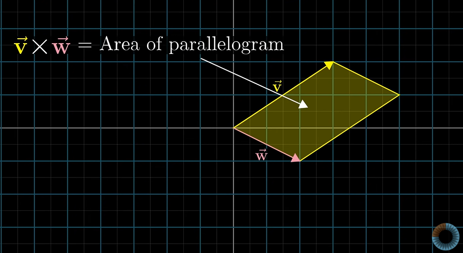

If v is on right of w , v cross w is +ve.

If v is on left of w , v cross w is -ve.

Therefore **Order matters**

Relationship with deterkminant
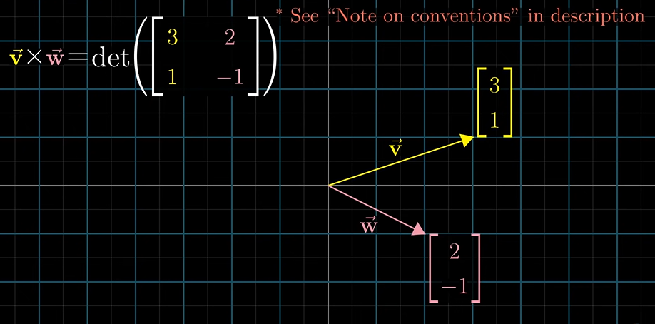

By representing linear transformation like this, we move the basis vectors i hat and j hat to vector v and vector w and calculate determinant.

If v is on left of w , orientation was flipped while carrying out linear transformation hence negative determinant.

When two products are perpendicular , the area enclosed is maximum and hence the cross product is maximum.

**3v cross w = 3(v cross w)**

True cross product is something which combines two 3d vectors to form a new 3d vector which has length equal to the area enclosed by these two vectors and orientation can be calculated by the right hand rule.
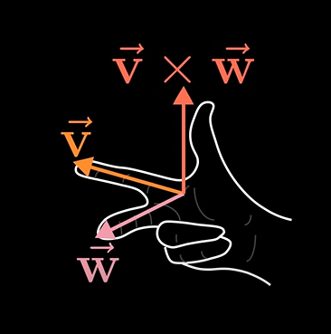

example:

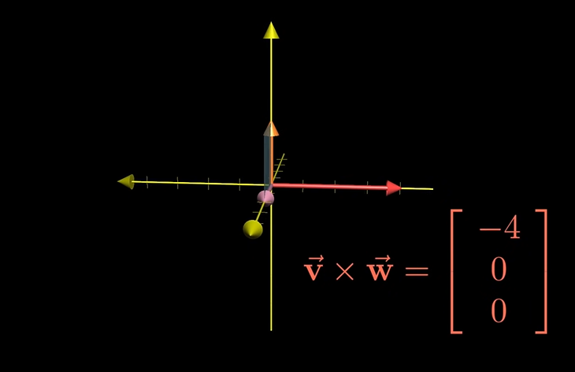

general formula:
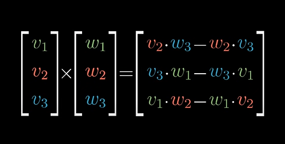

method:

The vector thus obtained is the cross product of the two vectors perpendicular to both of them.

## 11_Fancy explanation 

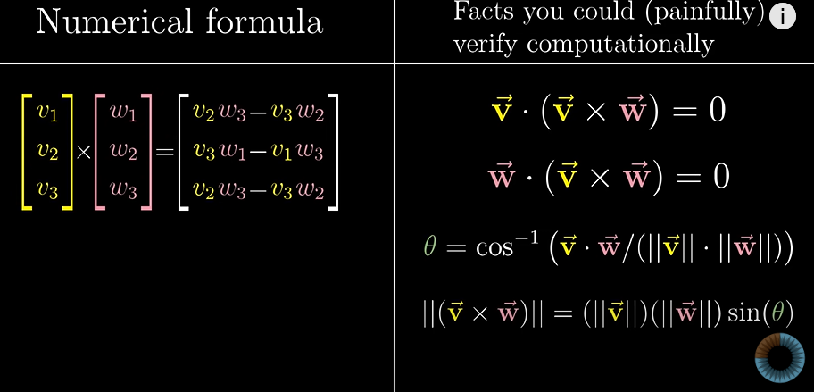

1) Define a 3d to 1d linear transformation in terms of vector v and vector w

2)Find its dyal vector

3)Show that this dual is vector v cross w

 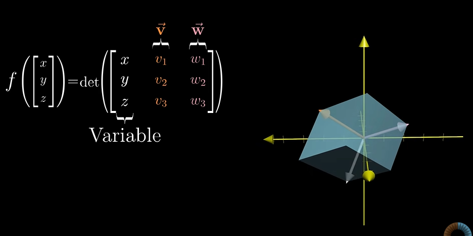

The function f can be defined as some function which calculates the volume bounded by the two vectors and a arbitrary [x y z](vertical) vector.

This is a linear function and hence dual.

To convert 3d to 1d the function f must be a linear transformation on that arbitrary vector about a 1 cross 3 matrix.

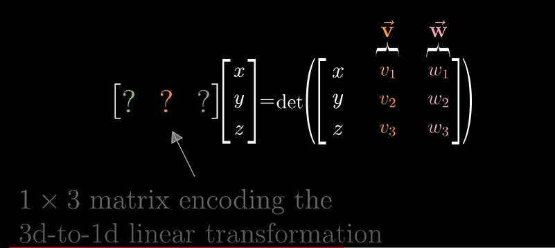

By duality , there exist some vector such that the dot product of the two vectors is equivalent to the linaer transformation of the arbitrary vector about the 1 cross 3 mstrix.
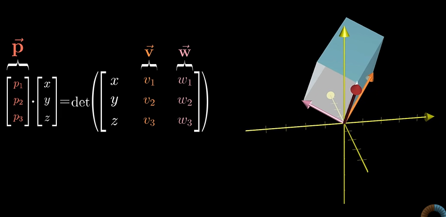

Therefore the cross product of two vectors gives a vector whose dot product with an arbitrary vector xyz gives the signed volume of the parallelopiped enclosed by the vector xyz and the two vectors.

**Geometrical Representation**

The dot product of vector p with an arbitrary vector xyz is the product of length of projection of that vector p on vector xyz  and the length of vector xyz. 

Hence volume can be represented as 
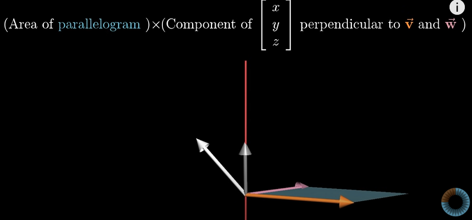 

This is same as taking dot product of xyz vector with a vector that is perpendicular to v and w and equal in length to the area of parrallelogram b/w v and w.
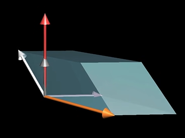

