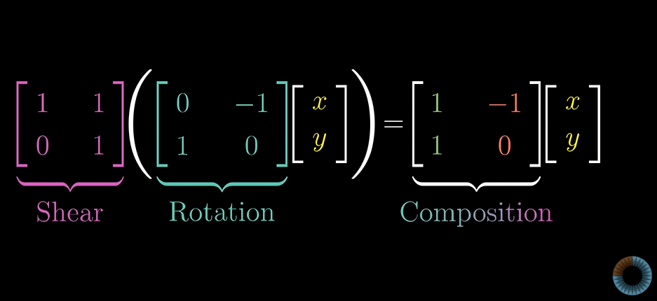
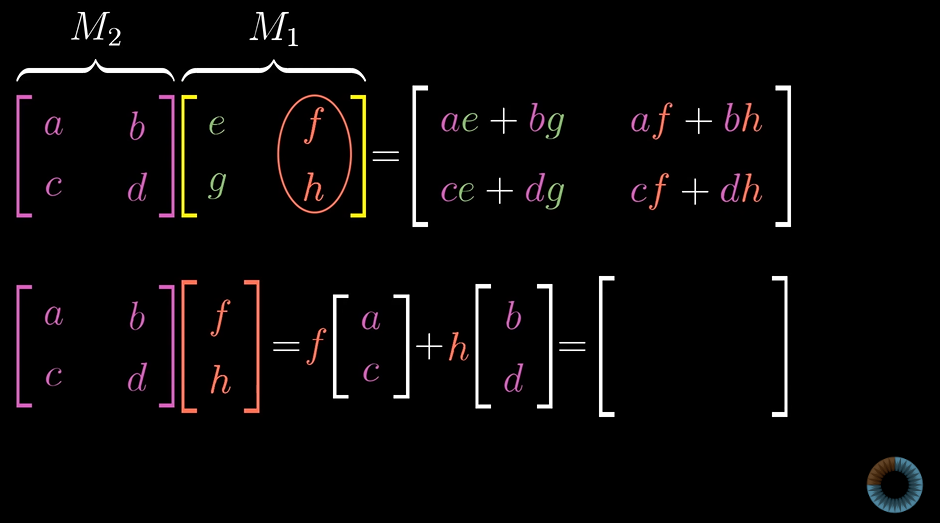

# Essence of linear Algebra

## Matrix multiplication as composition 

In many cases we want to apply two seperate transformstion on a vector.

The resultant transformation is a **Composition** of the fisrst ad second transformation.

We again track the final vector by seeing where i hat and j hat land.

Composition of the rotation and shear transformation

the general method of visualisation can be represented as

M1M2 != M2M1

(AB)C = A(BC)

Matrix Multiplication A(BC) can be visualised as Transformation of C about matrix B and this transformed matrix is transformed about A.

