# Projection matrix
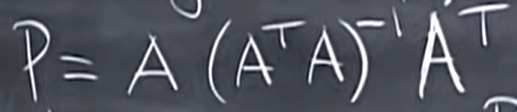

If a vector b is such that:

    it is entirely in this column space , Pb=b
        
        now b is entirely in the column space hence we can write b = AX
   
        
    it is perpendicular to the column space Pb=0
        
        perpendicular to the column space means I am in the null space of A transpose

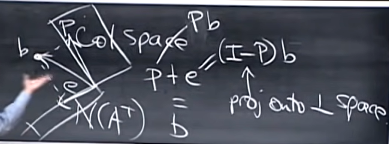

question: Find the best straight line

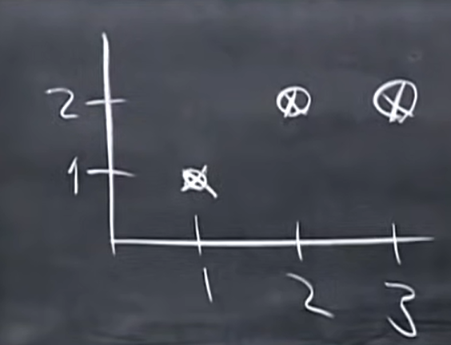

We assume  a line y = C+ Dt which does not go through these lines.

TO find the best straight line we need to minimize the error.

assume the line to pass through the points given in question

we get:
   
   C + D = 1
   
   C + 2D = 2
   
   C + 3D = 2
    
 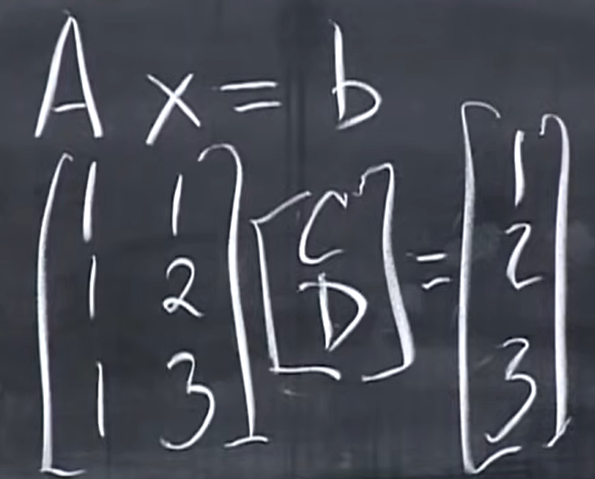
 
 replace 3 with 2 in soln matrix.
 
 Here the we get no soln.
 
 We want to make thw error small hence we try to make AX -b as small as possible which is the length of the vector
  
  
 
 Now what is this error in the picture.
  
  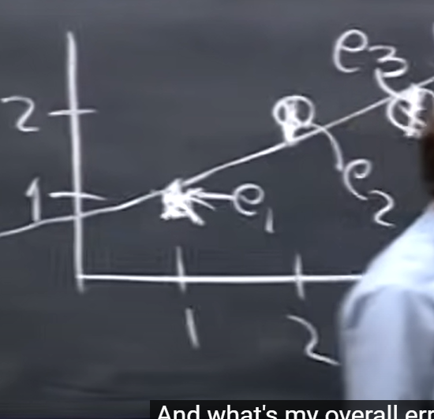 
  
 we are trying to minimize: e1^2 + e2^2 + e3^2
 
 This is linear regression
 
 Let P be the point on the line , b be the base vectors and e be the distance b/w them.
 
 Hence we have p1,b1,e1,p2,e2,b2,p3,e3 and b3.
 
 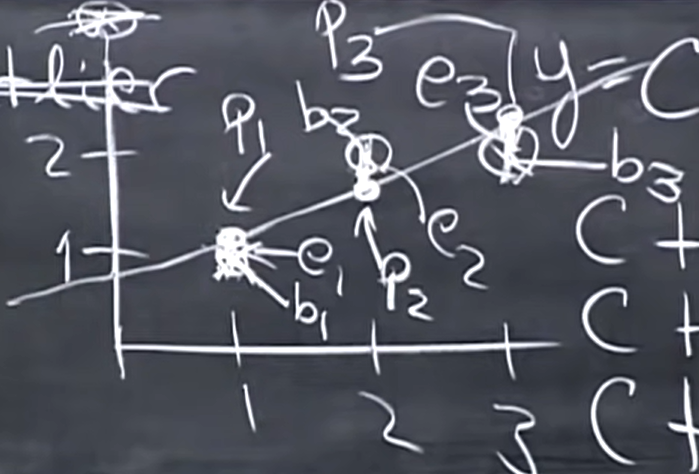
 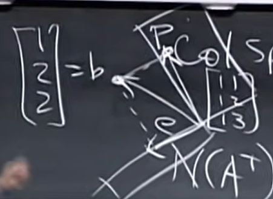 
 
 P is the closest point on the column space  

back to the question

we use this estimate of x whenever we solbve for error or noise

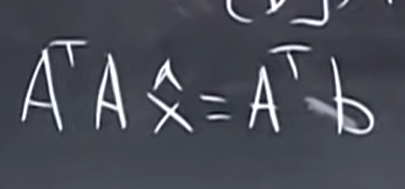

A^tA is expected to be symmetrical and inversible

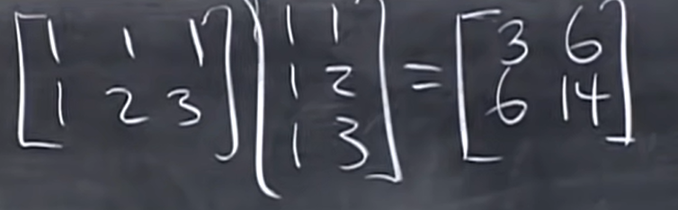

Now A^t x is: [5]
              [11]

we write the whole sole as an augumented matrix:

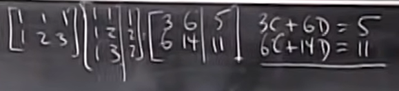

On solving , we get D = 1/2 and C = 2/3

Hence the best line is: y  = 2/3 + 1/2t

P1 = 7/6  , b1=1  ---> e1 = -1/6

P2 = 5/3  , b2=2  ---> e2 = 1/3

P3 = 13/6 , b3=2  ---> e3 = -1/6

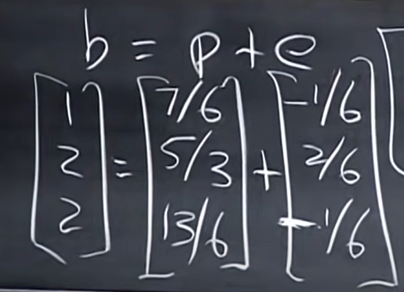

Also , the projection vector and the error vector are perpendicular

hence, P1e1 + P2e2 + P3e3 = 0

Hence , the error vector is perpendicular to the whole column space

Also , A = Px

To prove that A transpose A is invertible because A has independent columns, 

To prove : A^tA is invertible

suppose A^tAx = 0

Columns are definitely independent if they are perpendicular unit vectors(orthonormal vectors).
