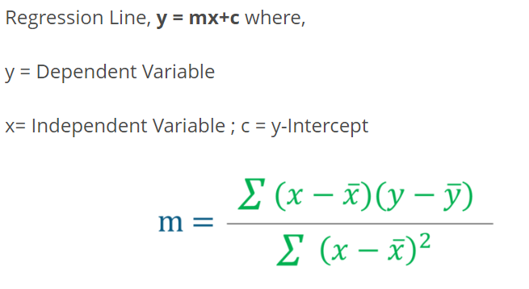

# Best line code

inputting data from csv file: use panda

Step 1: Import the required libraries 

    import numpy as np
    import pandas as pd
    import matplotlib.pyplot as plt

Step 2: Import the data set

    data = pd.read_csv('C:UsersNeelTempDesktopheadbrain.csv')
    print(data.shape)
    (237, 4)
    print(data.head())
           Gender  Age        Range    Head Size(cm^3)   Brain Weight(grams)
            0       1          1             4512                 1530
            1       1          1             3738                 1297
            2       1          1             4261                 1335
            3       1          1             3777                 1282
            4       1          1             4177                 1590

Step 3: Assigning ‘X’ as independent variable and ‘Y’ as dependent variable

    X = data['Head Size(cm^3)'].values
    Y = data['Brain Weight(grams)'].values

## Least Squares Regression

    # Mean X and Y
    mean_x = np.mean(X)
    mean_y = np.mean(Y)
    
    # Total number of values
    n = len(X)

    # Using the formula to calculate 'm' and 'c'
    numer = 0
    denom = 0
    for i in range(n):
    numer += (X[i] - mean_x) * (Y[i] - mean_y)
    denom += (X[i] - mean_x) ** 2
    m = numer / denom
    c = mean_y - (m * mean_x)
    
    # Printing coefficients
    print("Coefficients")
    print(m, c)

        Coefficients
        0.26342933948939945 325.57342104944223
        
Step 5: Plotting the line of best fit

    # Plotting Values and Regression Line
 
    max_x = np.max(X) + 100
    min_x = np.min(X) - 100
    
    # Calculating line values x and y
    x = np.linspace(min_x, max_x, 1000)
    y = c + m * x
    
    # Ploting Line
    plt.plot(x, y, color='#58b970', label='Regression Line')
    # Ploting Scatter Points
    plt.scatter(X, Y, c='#ef5423', label='Scatter Plot')
    
    plt.xlabel('Head Size in cm3')
    plt.ylabel('Brain Weight in grams')
    plt.legend()
    plt.show()

   

Step 6: Model Evaluation

M1: RMSE

    # Calculating Root Mean Squares Error
    rmse = 0
    for i in range(n):
        y_pred = c + m * X[i]
        rmse += (Y[i] - y_pred) ** 2
    rmse = np.sqrt(rmse/n)
    print("RMSE")
    print(rmse)

        RMSE
        72.1206213783709

M2: R-squared value

Where,

SSt​ is the total sum of squares
SSr​ is the total sum of squares of residuals

    # Calculating R2 Score
    ss_tot = 0
    ss_res = 0
    for i in range(n):
        y_pred = c + m * X[i]
        ss_tot += (Y[i] - mean_y) ** 2
        ss_res += (Y[i] - y_pred) ** 2
    r2 = 1 - (ss_res/ss_tot)
    print("R2 Score")
    print(r2)
        
        R2 Score
        0.6393117199570003
