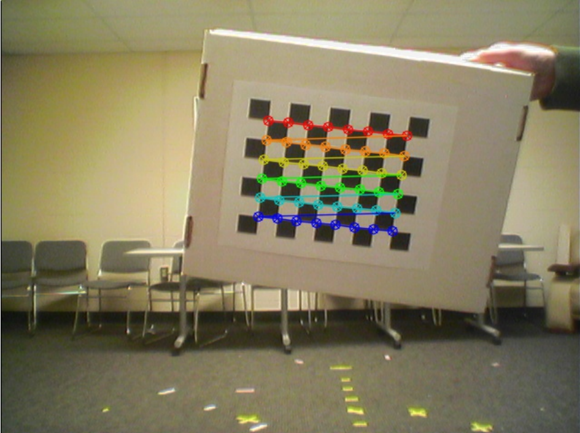
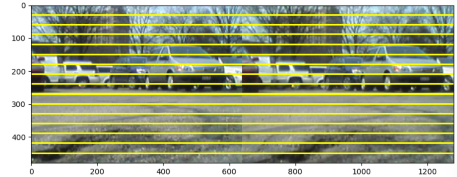
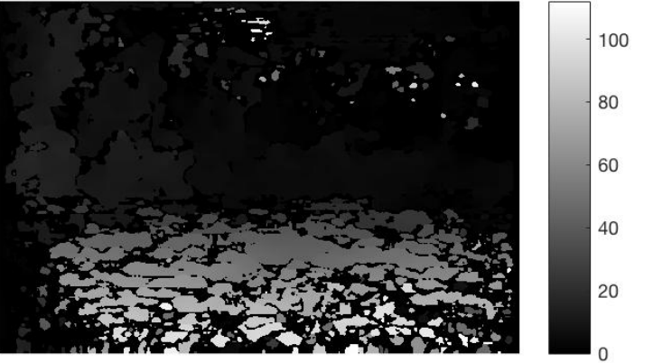
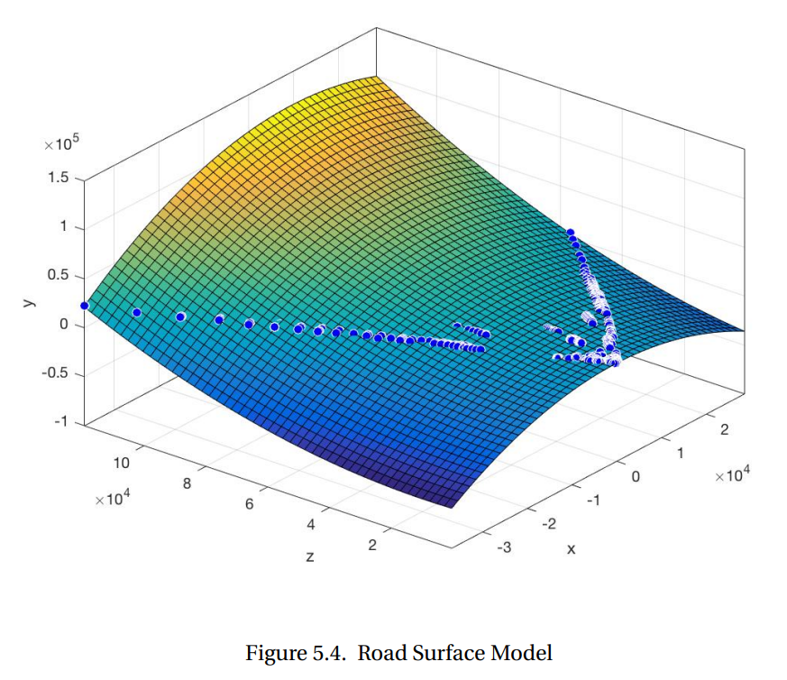
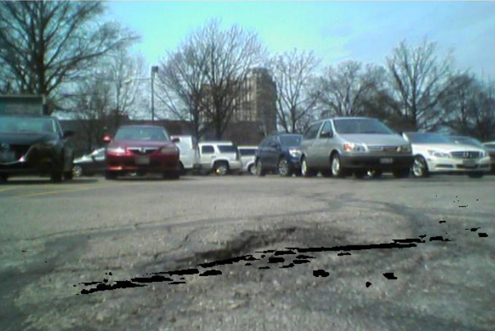
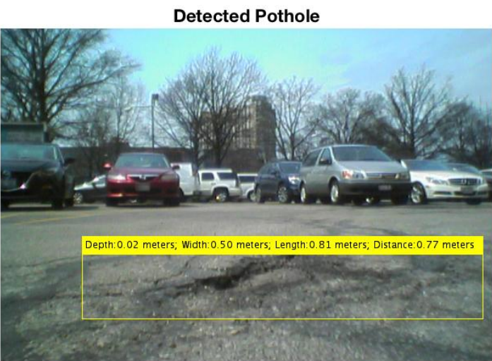
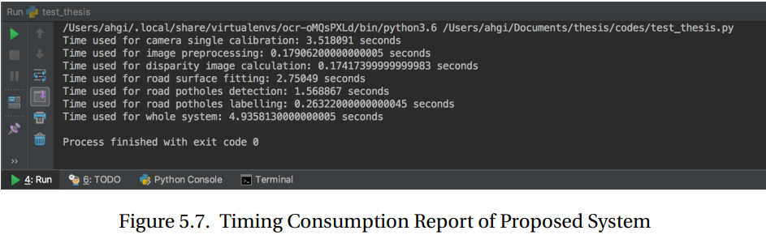

# Result

## Caliberation Result

If we can correctly find each corner in the checkerboard and obtain the length of each checkerboard in image coordinates, we can easily calculate camera parameters using Zhang's method, because we already know the length of each square in the checkerboard in world coordinates.

## Disparity Result

With the rectified stereo image pair :

We calculate the corresponding disparity image.

Points closer to cameras are brighter, and their disparities are higher. 

But due to mismatch of stereo image pair , there is a lack of features in those regions.

## Pothole Detection result

We draw the fitted road surface model compared with the real road image.

The lower points on the fitted surface are plotted in cooler color like blue and green.

The detected pothole regions which are lower than the fitted road surface are labelled in black in the road surface image.

We also calculate the geometric information of the pothole.

## Time Consumption

The time consumption depends on image size as well. The larger the image size is; the more pixels need to be processed; the longer it takes.Therefore, we only select the road surface in front of car as region of interest (ROI) to reduce the timing consumption for the proposed road pothole detection system.

Here the camera caliberation step once done will not be repeated hence for subsequent measurement the time consumption can be lesser.

If , the total time of a road pothole detection is around 5s, which means if the car drives at 30 miles/hour , we should detect the road pothole at least 14 meters in advance.

The time consumption for road pothole labelling depends on how many potholes detected. If 0 pothole detected, the time consumption for this  part is 0 as well.

