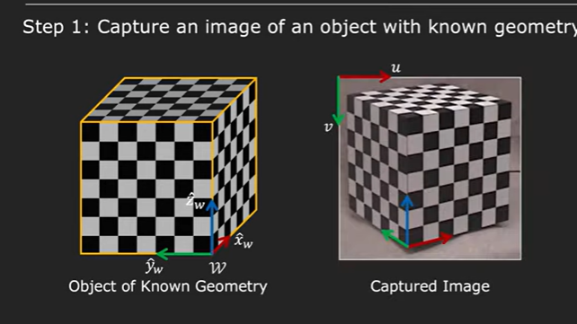
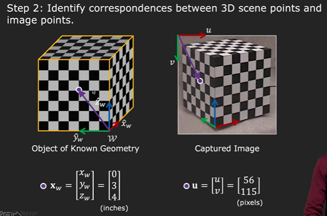
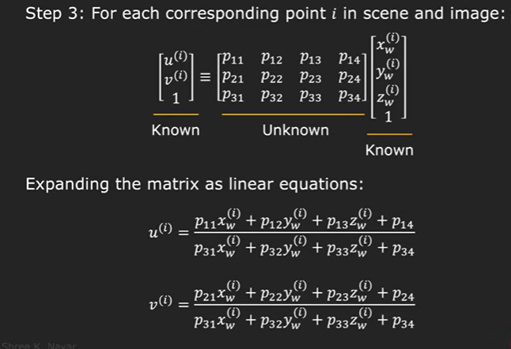
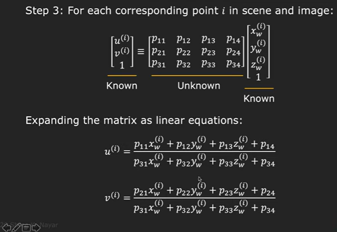
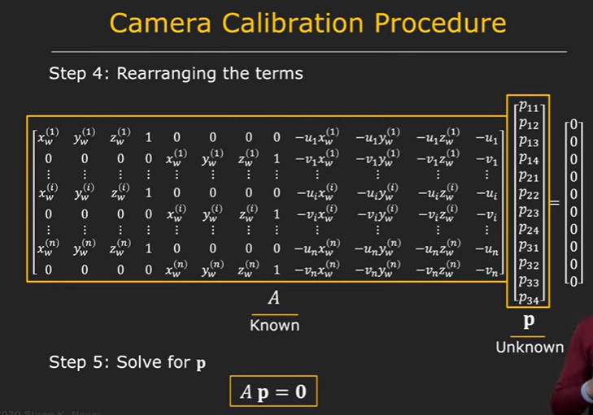
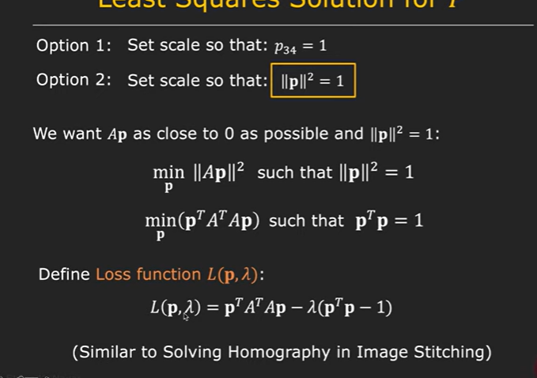
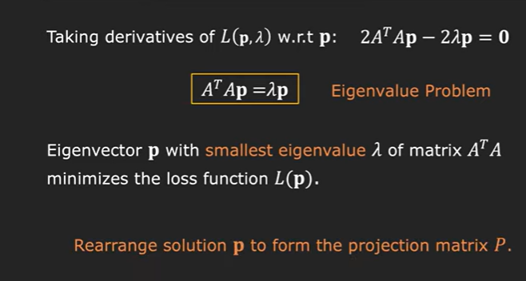

# Camera caliberation

Step 1: Capture an image of an object with known geometry
        
        We take a checkerboard cube and assign one of its corner as world coordinate ceter,

        We take an image of tis cube and assign the top-left part as image origin.

   

Step 2: Identify correspondences between 3D scene points and image points.

        We establish correspondance between all characteristic points like this.

        Hence we end up with a set of corresponding points from 3D to 2D

Step 3: For each coresponding point in scene and image:

        Here we know the image points and the the world coordinates and we solve for projection matrix.

Step 4: rearrange the terms

step 5: Solve

Now if we take image of an object using a camera and then scale both the object and camera by finite ammount and take the image, the two images taken are identical!

Hence scaling does not produce any change on the projection matrix.

Hence we can set the scale of images arbitrarily

Hence we have the following two options w.r.t scaling

    1) Set scale so that any arbitrary element say p34 of the projection matrix is zero.

    2) Set scale so that: square of determinant of projection matrix is one.

    matrix property p^tp = |p|^2

   

   

   Through these series of calculations , we come to the conclusion that the vector p that we are looking for is the eigenvector cooresponding to the smallest eigenvalue of matrix A^tA