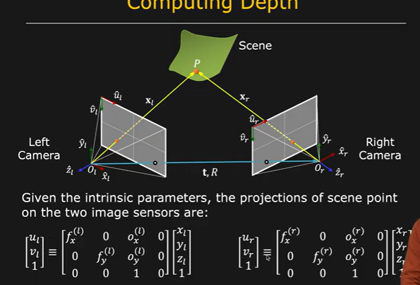
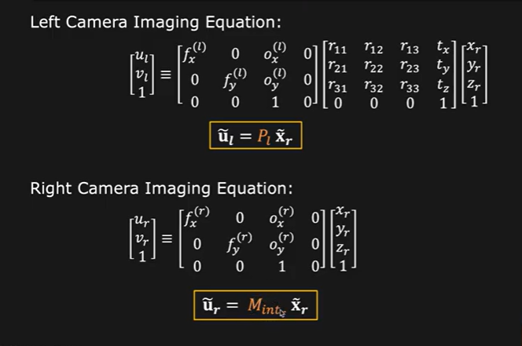
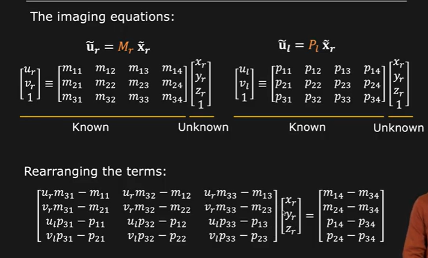
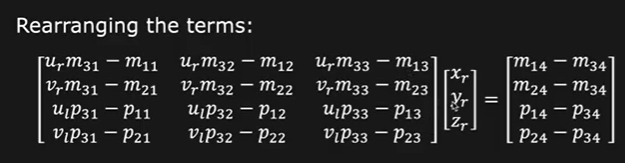
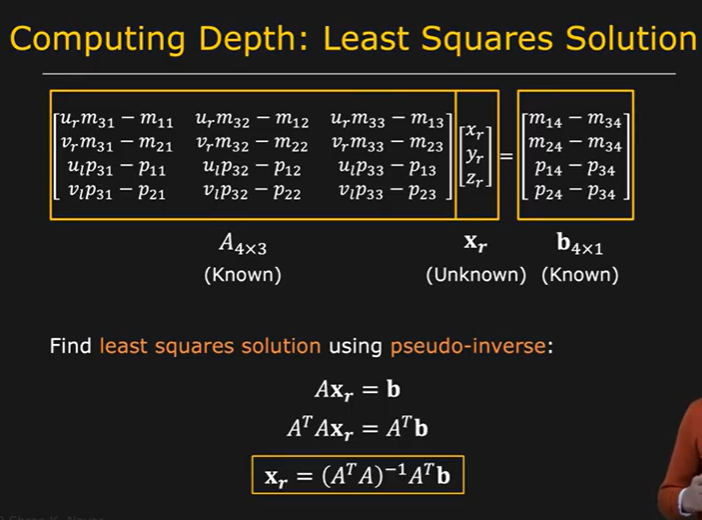

# Computing Depth

the world coordinates are converted into the respective image coordinates.

We know the camera caliberation as

Hence:

  **Hence through this caliberation system we go from arbitrary views to depth map of scene**

We can use this for 3D reconstruction!

refer ref video from 4:55 mins 