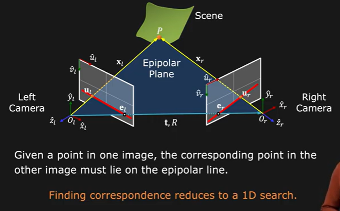
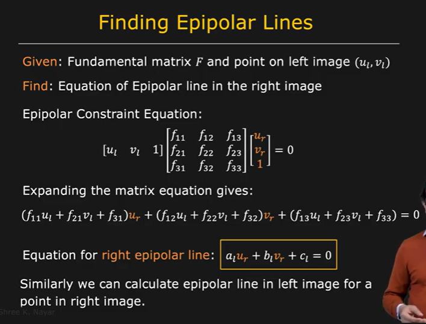
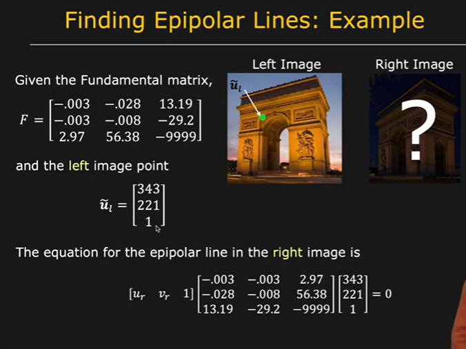
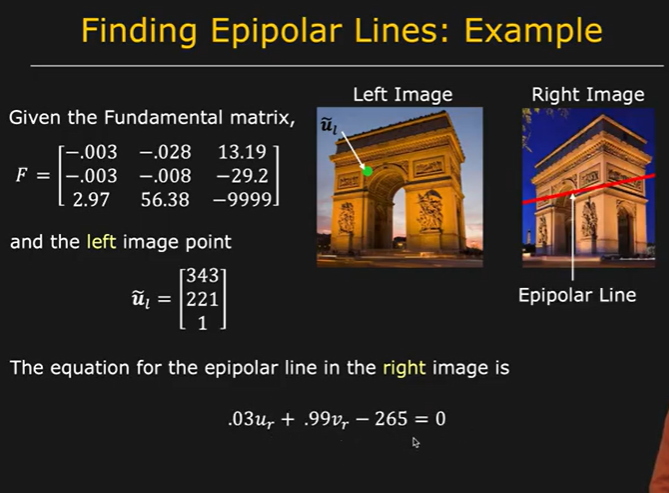
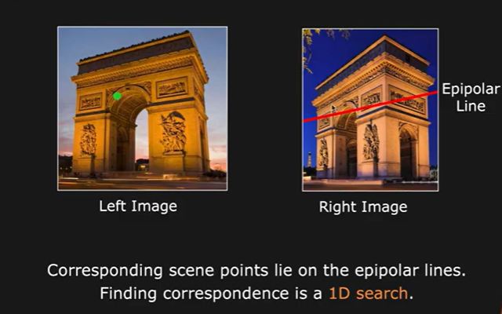

# finding Correspondences

The epipolar plane intersects with the image plane giving the epipolar line

epipolar line corresponds to the projection of all the points on the ray ui-P on the right image frame.

How to find epipolar lines?

Eg:

