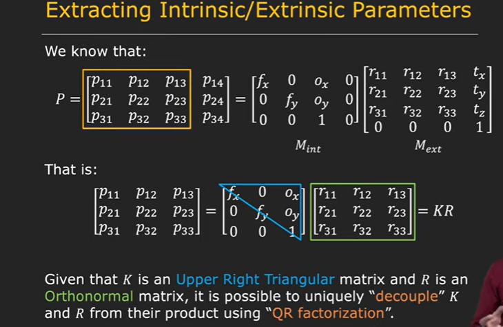
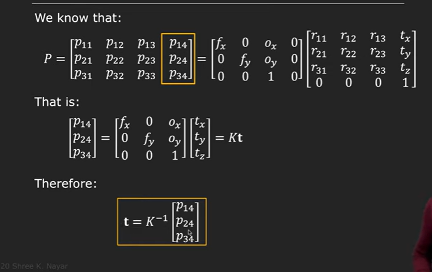

# Intrinsic and Extrinsic Matrix  

Now we know that our projection matrix is inclusive of Intrinsic matrix as well as the extrinsic matrix

Intrinsic matrix is all the intrinsic parameters such as focal length and camera posiltion

Extrinsic matrix is the rotational matrix

K is the caliberation matrix and R is the Rotational matrix.

A matrix which is a product of upper right triangular matrix and a orthonprmal matrix , we can **Decouple** two matrices from their product using **QR factorization**

Now we found the rotational matrix and the intrinsic matrix and now we need the translational matrix.

In case of lens , we have other intrinsic parameters and the intinsic model of the camera will need to include the distortion coefficients.

Qr factorization:

[ref1](https://www.youtube.com/watch?v=6DybLNNkWyE)

[ref2](https://www.youtube.com/watch?v=qmRC8mTPGI8)

[ref3](https://www.math.ucla.edu/~yanovsky/Teaching/Math151B/handouts/GramSchmidt.pdf)