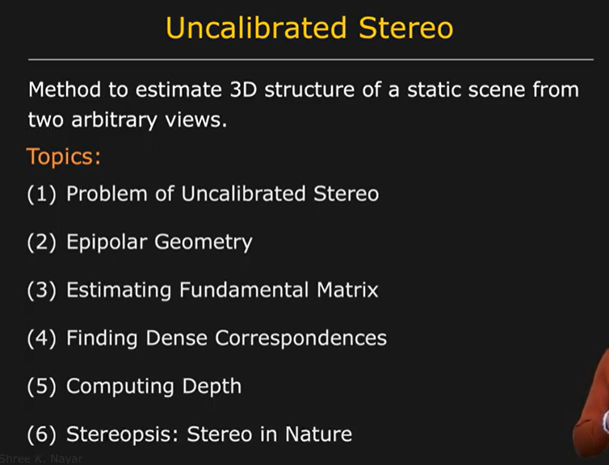

# Uncaliberated stereo overview

Suppose a camera takes an image of an object at certain orientation and at certain position.Now some oher camera takes the image of the object at an angle and position completely different from the current angle and position. 

Now , if we know the internal parameters of the two camera we can calculate the position and orientation of one camera w.r.t. other camera and as a result calculate the deph of the 3D object.

