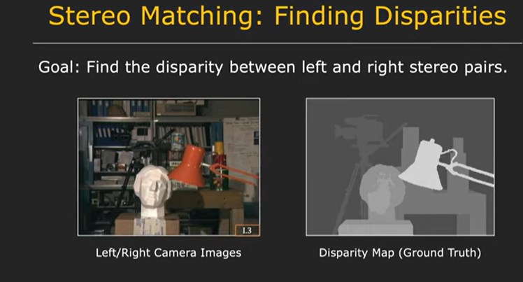
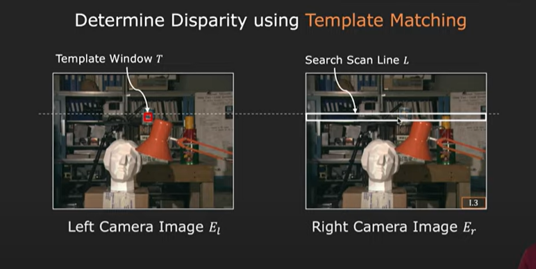
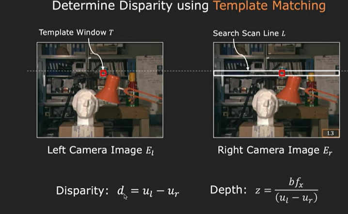
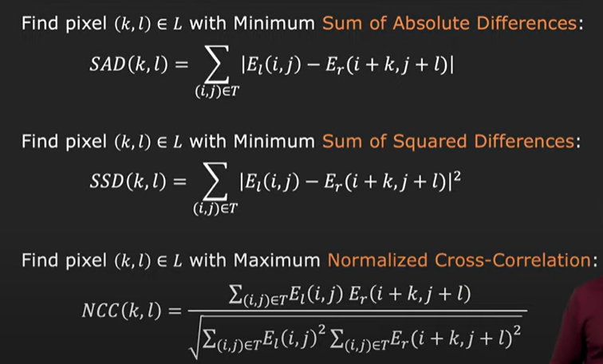
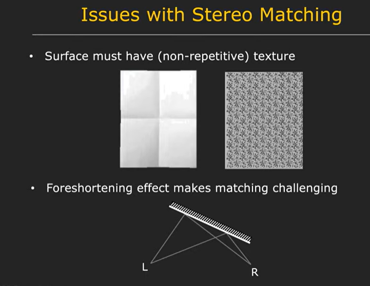
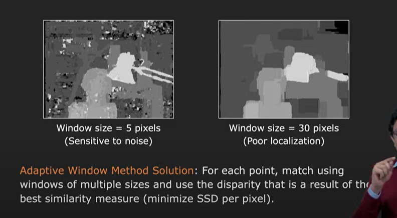

# Stereo

**contd from What is Stereo.md**

if the scene is at infinity , it does not matter where the camera are with respect to each other. The disparity is zero. Hence , we get two identical images.

Deph z is inversely proportional to the disparity of camera

Disparity is proportionak to baseline.

**Stereo Matching**

Finding correspondance between two images.

closer the point is , greater the disparity and greater is its brightness in the disparity map

There is no disparity in vertical direction in horizontal stereo system

Therefore, corresponding points must lie on same horizontal level in the right image as in the left image

We use this window and match along every pixel in scan line and point where it matches best is used to compute disparity.

we match matrices using:

Issues with stereo matching:

 Surface must have **non-repetitive** **texture**

 Foreshortening causes difference in brightness. Therefore we incorporate warping techniques so as to make matching process more robust.

If window size is small , we have more noise in the disparity map

If window size is big , we have more blurred disparity map

solution: use multiple windows

