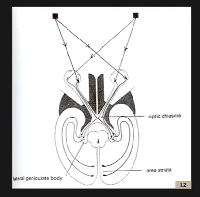
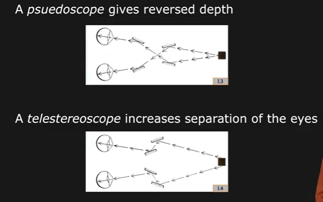
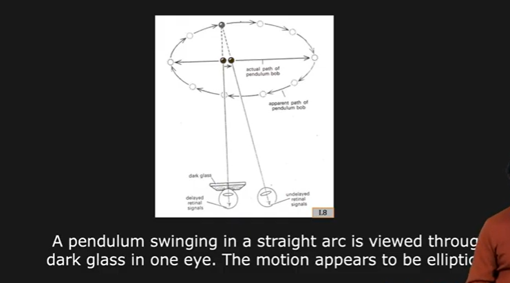

# Stereo vision in nature

Stereo vision in human eye

Pulfrich Pendulum effect:

One of the eye say , the left eye is covered with very dark sunshades.the other one does not have sunshade in front of it. 

Infront , there is a pendulumn where a ball goes back and forth in a line.

Since there is a dark glass in front of left eye, it produces an image of the object with a little bit of a delay.  

Image of an object at a point is percieved when it has already moved from a point and is being percieved by right eye at this new position.

Therefore if we triangulate with these two images, we percieve the object to be at a greater deph behind the two images.

Stratton's Experiment:

Stranton used a contraption to view the world upside-down

Obv: Humans and monkeys are able to adapt to new vision orientation

Hens can;t do this!