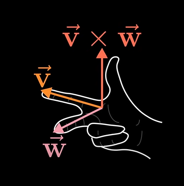
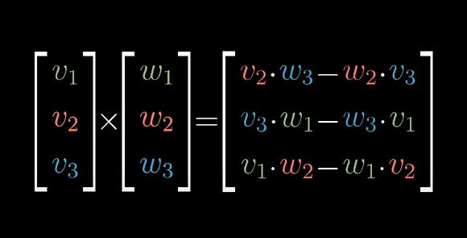

# 10_CrossProducts

Cross products of vector v and vector w in 3d is the area enclosed by a parrallelogram within the 2 vectors Taking orientation into consideration.

If v is on right of w , v cross w is +ve.

If v is on left of w , v cross w is -ve.

Therefore **Order matters**

Relationship with deterkminant

By representing linear transformation like this, we move the basis vectors i hat and j hat to vector v and vector w and calculate determinant.

If v is on left of w , orientation was flipped while carrying out linear transformation hence negative determinant.

When two products are perpendicular , the area enclosed is maximum and hence the cross product is maximum.

**3v cross w = 3(v cross w)**

True cross product is something which combines two 3d vectors to form a new 3d vector which has length equal to the area enclosed by these two vectors and orientation can be calculated by the right hand rule.

example:

general formula:

method:

The vector thus obtained is the cross product of the two vectors perpendicular to both of them.

