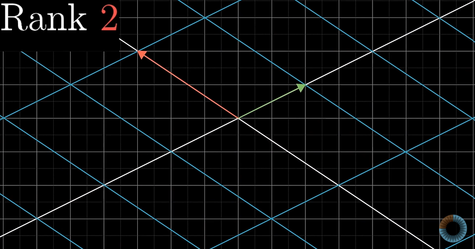

# Inverse matrix

A system of equation with three unknown variables can be written as a vector(unknowns) on which transformation(coeeficient matrix) is applied to see where it lands(constants)

if det(A) !=0

Inverse of a transsformation matrix is another matrix such that when the two transformation are applied together there is no net change in position of the vector.

When we apply a inverse Transformation matrix to the constant vector we land on the vector of unknowns.
Hence Inverse Matrix can be said to be that matrix transformation which when applied on a vector in space(which is known) lands on another vector in space(which is unknown),

Hence the system of equation is solved.

when det(A)=0

Inverse does not exist.

But the solution can still exist if the vector v(constant vector) lies somewhere on the line(obtained ater linear transformation)

## Rank

Number of dimensions in the output

**Rank 1**
    output one dimension after transformation
    
    

**Rank 2**
    output 2 dimensional after transformation
    
    (best that can be for 2 Dimensional matrix)
    
**Rank 3**
    output 3-dimensional after transformation
    

Set of all possible outputs of Av(vector) gives the **column space** of A

Columns of a matrix tell where the basis vectors land after transformation.**Column space** represents the span of columns.

**Rank** can be the the number of dimensions in the column space

Full Rank means that the Rank is equal to the maximum number of transformation.

**Null space** or **Kernel** of a matrix are a set of column vectors whose linear transformation about the given vector gives a zero vector. Since origin is always at same position during a linear transformation, a null space always consist of a zero vector.

https://media.discordapp.net/attachments/1006253032973021295/1010970343743168572/unknown.png

