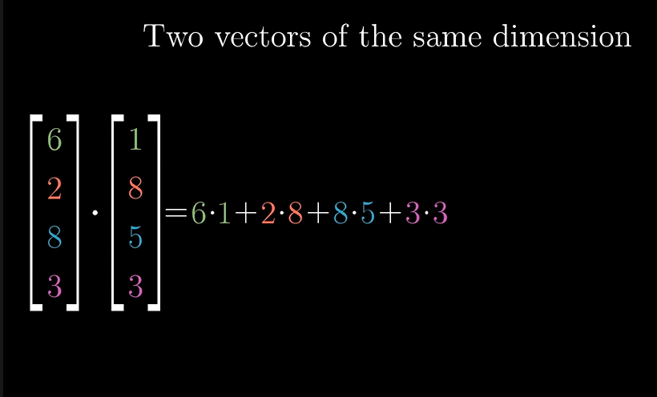
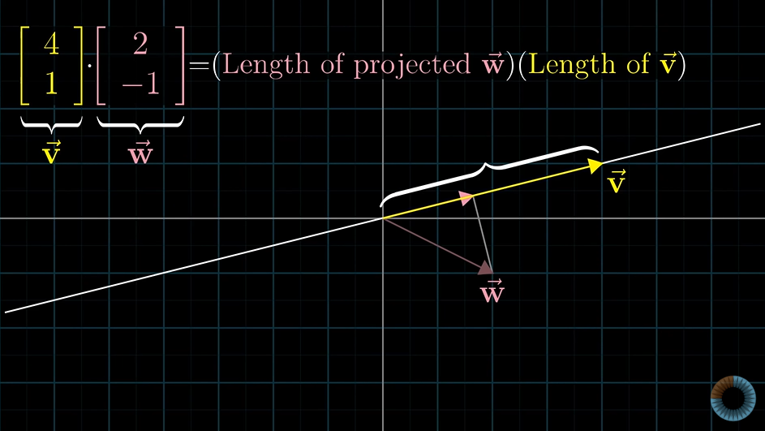
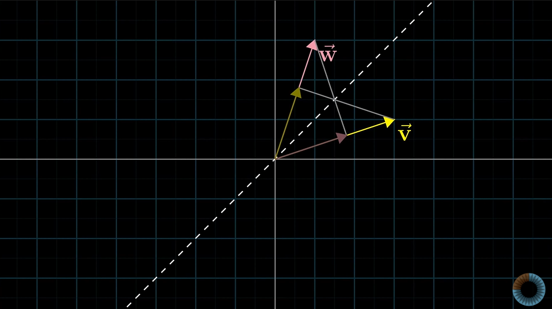
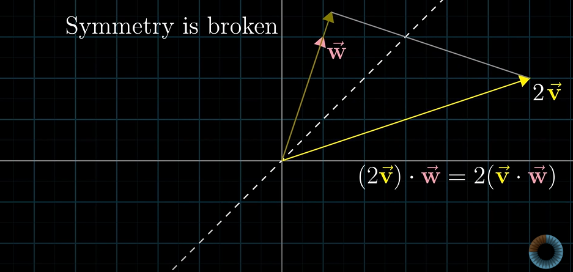
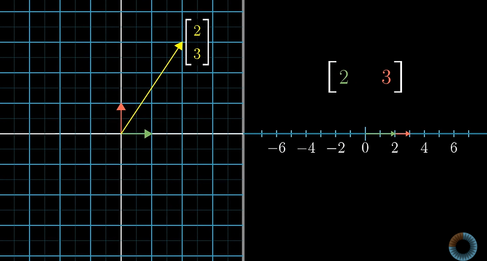
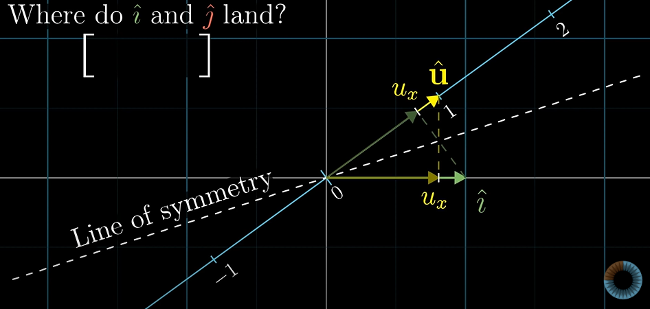
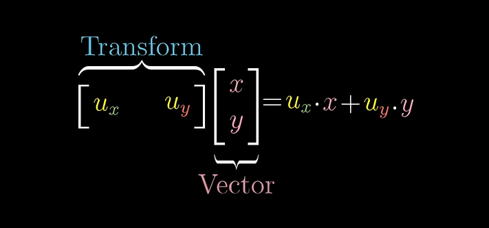
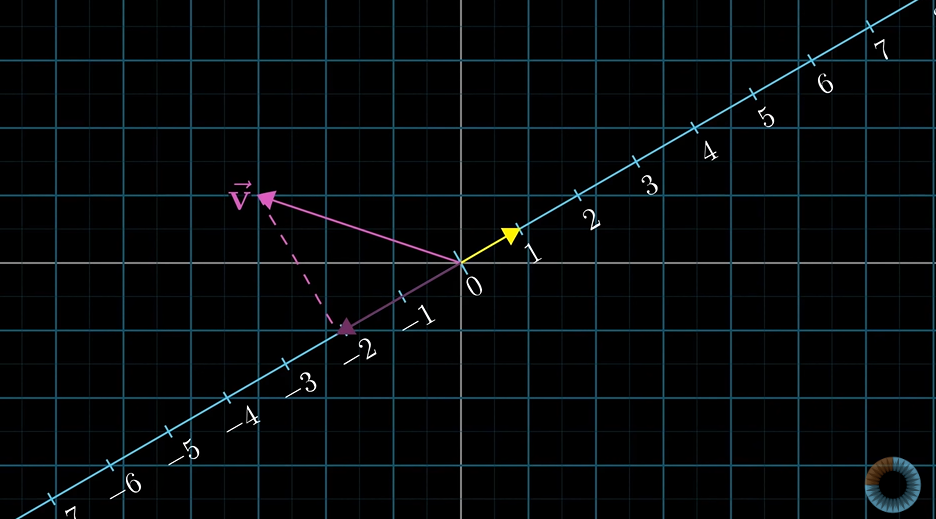
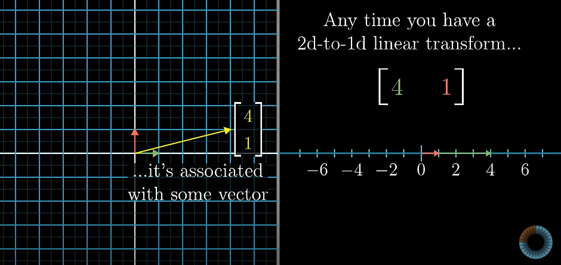

# Dot products and duality

general representation
    

vector representation

Therefore dot product of vector v and vector w can be described as:
    imagine taking a projection of w on line joining origin with tip of vector v.THe dot product is the length of projected w and length of vector v.
When projection is pointing in same direction, product is +ve

When projection is pointing in opposite direction, product is -ve

else in case the two vectors are perpendicular , the product is 0.
v.w =0 

**IMP: order does not matter!**

if the length of the two vectors is same we can imagine a line of symmetry about the twi vectors.

if one of these vectors is now scaled say v changes to 2v , now the dot product of 2v nd w , the length of projection remains same but that of vector doubles.If we calculate w.2v , length of vector remains same but that of projection becomes double. 

From where does the idea of dot product being related to length originate from?

There exist some relation between the 1 by 2 matrices and 2d vectors.

HEnce there is some type of connection between linear transformations that take vectors to numbers and numbers to vectors.

To better understand lets do the following activity.

    1. we take a copy of the number line and place diagonally on the coordinate system with zero of the number line at the origin itself.

    2. u hat is a unit vecctor whose tip sits on 1 of the number line.

    3. we perform a fuction on all vectors such that they are projected onto the number line by linear transformation

    4. To find the transformation matrix , we locate where i hat and j hat land on the number line. Since the three are unit vectors , projecting i hat on the number line is same as projecting the u hat on the x and y axis respectively to get i hat amd j hat. Therefore
    projection of i hat on number line is x cooridnate of vector u and projection of j hat on number line is y coordinate of the vector u.
  
  
    
    5.Therefore entries of the rotational matrix are the x coordinate and y coordinate of vector u. 
   
   
    
    6. Therefore dot product of a vector and unit vector can be defined as taking the unit vector , projecting it onto the vector and and multiplying the length.
  
  

    7. In case of a non-unit vector the the projection is first taken and then scaled.

Because the transformation was linear it had to be described in terms of a 1 by 2 matrix.

Hence whenever there is a linear transformation that converts a 2d vector into a 1-d line , there exists some vector such that taking dot product with that vector is same as applying the linear transformation to get the number line from the 2-d space.

  

THIS IS **DUALITY**

Duality in mathematics represents a natural but surprising correspondamce between two types of mathematical things.

Dual of a vector is a linear transformation into a 1d line.

Dual of a linear transformation is a vector in that space.
