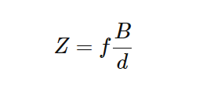
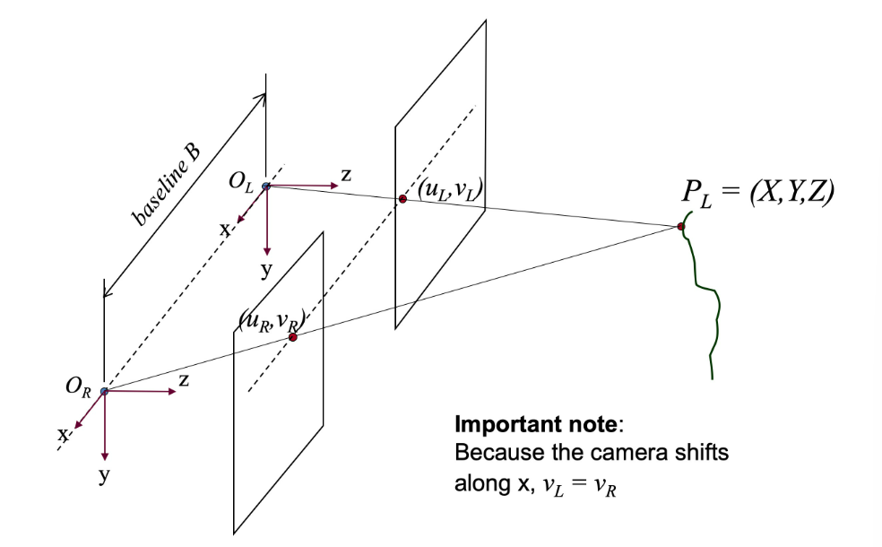
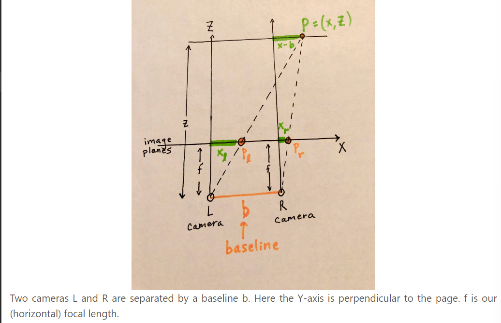
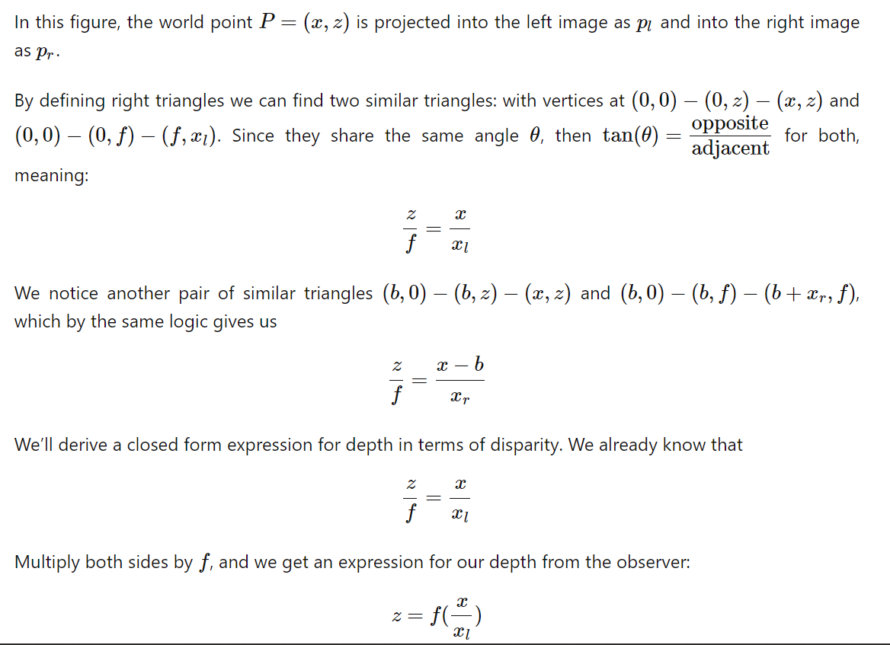
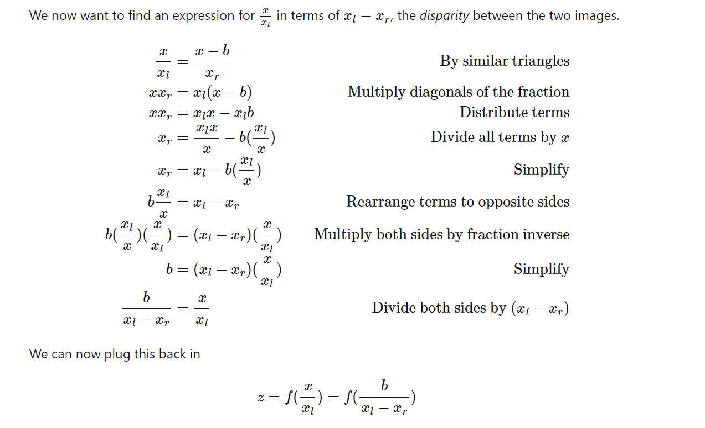
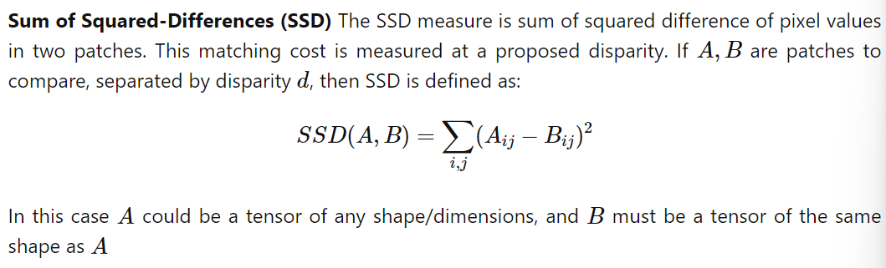
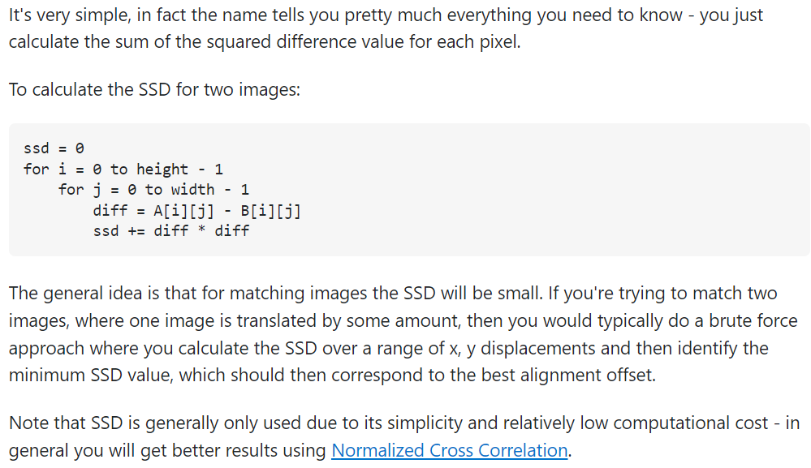
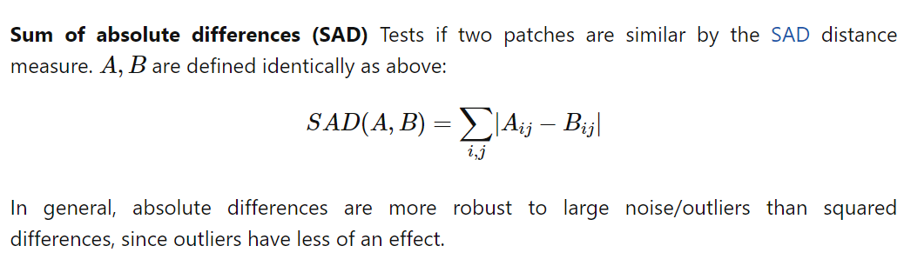
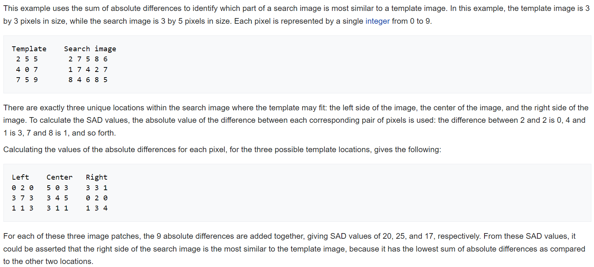
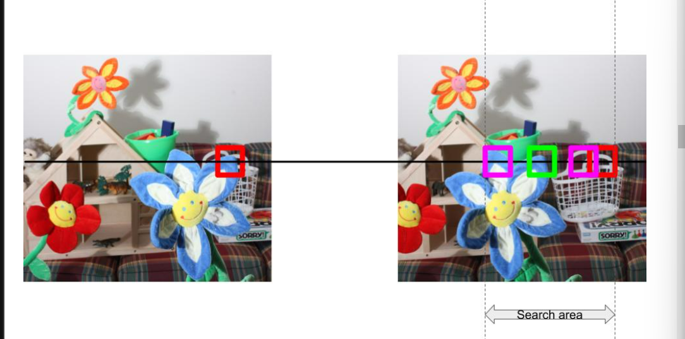

# Paper by Jhon Lambert

“Stereo matching” is the task of estimating a 3D model of a scene from two or more images

Humans use stereo vision with baseline distance 60mm.

The camera could be moving.

2d shifts are called “parallax”.
 
If we fix the cameras’s position relative to each other, we can calibrate just once and operate under a known relationship(if possible). 

However we may need to calibrate them constantly, if cameras are constantly moving with respect to one another.

Now after the images have been captured in caliberated cameras, we need to find the pixels corresponding to the same point.

## The Correspondence Problem

**The correspondence problem is defined as finding a match across these two images to determine, What is the part of the scene on the right that matches that location?**

## Stereo Geometry

We calculate depth as:

This is true in case of both:

## Disparity 

**Key takeaways from above calculations**

The amount of horizontal distance between the object in left image  and in right image (the disparity d) is inversely proportional to the distance z from the observer(Depth).

We made two large assumptions:

    1.We know the focal length f and the baseline b. This requires prior knowledge or camera calibration.

    2.We need to find point correspondences, e.g. find the corresponding (xr,yr) for each (xl,yl).

## Solving the Correspondence problem

## Classical Matching Techniques

To solve the correspondence problem, we must be able to decide if two chunks of pixels (e.g. patches) are the same.

For rectified stereo imges, all scanlines are epipolar lines which converege at infinity.

To convert matching of two pixels to a search or optimization problem, we'll need a vector representation and then a matching cost.

We consider the image as a vector where each window of pixel represents a vector point. 

If we have found a good match, then the angle between the vectors will be zero, and we can use the cosine of this angle to measure this.

Inner product, or normalized correlation are measures of similarity. 

Stereo correspondence methods rely on matching costs for computing the similarity of image locations

Two distance measures are most common for testing patch similarity, and can serve as “matching costs”

[SSD_Working](https://stackoverflow.com/questions/26011224/how-does-sum-of-squared-difference-algorithm-work)

[SAD_Working](https://en.wikipedia.org/wiki/Sum_of_absolute_differences)

Correspondance lies on a epipolar line.

We know the fundamental matrix between two images.

Now, we search along a 1d line to kniw The exact pixel location of a match.

EG:

Here the image is rectified such that we have a horizontal search line.

we pick a patch (matrix) in left image with leftmost column say i.

We start from this very column number in the right image and move rightwards(as object shifts from left to right in a right image).

We calculate the similarity difference value for each patch as indicated by pink patches in the right image and finally get the best matching patch with the least difference indicated by the green patch 

The horizontal shift from red patch to green patch is the disparity value for center of p1 in the left image.

## Disparity Map

We calculate the disparity value at each pixel by searching a small patch around a pixel from the left image in the right image.

    Doubt: If we want to calculate disparity at the top-left point of image, we need it to be at the center of our search patch.
    Does this mean we will have to surround our image with a b;lack null layer as we did in pixels?

    1.We follow the convention of search input in left image and search target in right image

    2. If we get same similarity difference(which is minimum) for different disparity value , we comsider that disparity value that is minimum

    3. We bound the search w.r.t the patch center.

## Cost Volume

Though we consider only the similarity diff that is minimum, we store the tensor of error profile at each pixel locaton along the third dimension{accc to me here we store the similarity diff for each and every patch in the right image that we compare with the patch in left image in a third dimension at the center og the patch(instead of (i,j) it will now be (i,j,error)}

Hence we calculate the cost volume

Each pixel will have a maximum disparity value associated with it.

   >  Doubt:When we calculate max disparity should the matching cost be minimum or not? Cause if the matching cost is not minimum we will always end up with the left most point along the epipolar line.

We calculate the cost or similarity of different disparities and put it into a tensor with the pixel values.

The cost volume tensor of shape (H,W,D). H,W are image dimensions, and D is max_disparity. 

cost_volume[x,y,d] represents the similarity or cost between a patch around left[x,y] and a patch shifted by disparity d in the right image.

If the shifted patch in the right image will go out of bounds, it is good to set the default cost for that pixel and disparity to be something high(we recommend 255), so that when we consider costs, valid disparities will have a lower cost.

## Error profile

In disparity map, we analyse the similarity error between patches.
You will have to find out different patches in the image which exhibit a close-to-convex error profile, and a highly non-convex profile.

[convex and non-convex problems](https://www.youtube.com/watch?v=7QmGj1_i3MU)

## Smoothing

Issue with SSD and SAD cost matching is that they are not very smooth. Adjacent pixels have vastly different disparities makking the result look very noisy and patchy in some areas.

But , pixels next to each other should have a smooth transition in disparity(unless at an object boundary or occlusion).

One way to improve disparity map results is by using a smoothing constraint, such as Semi-Global Matching(SGM) or Semi-Global Block Matching before we picked the disparity for a pixel based on the minimum matching cost of the block using some metric(SSD or SAD).

The basic idea of SGM is to penalize pixels with a disparity that’s very different than their neighbors by adding a penalty term on top of the matching cost term.

**Why smoothning?**

Smoothing should help in noisy areas of an image. But it will only help to alleviate particular types of noise. It is not a definitive solution to obtaining better depth maps.

Smoothing performs best on background/uniform areas: disparity values here are already similar to each other, so smoothing doesn’t have to make any drastic changes. Pixels near each other are actually supposed to have similar disparity values, so the technique makes sense in these regions.

Occlusion in an image occurs when an object hides a part of another object. The areas that are occluded depend on the position of the camera relative to the scene.

Smoothing can also help in areas of occlusion, where SAD may not be able to find any suitable match. Smoothing will curb the problems by pushing the dispairty of a pixel to be similar to that of its neighbors.

Smoothing performs poorly in areas of fine detail, with narrow objects. It also performs poorly in areas with many edges and depth discontinuities. Smoothing algorithms penalize large disparity differences in closeby regions (which can actually occur in practice). Smoothing penalizes sharp disparity changes (corresponding to depth discontinuities).

## **Challenges**

SSD/SAD suffers from:

Large “blobs” of disparities, can have areas of large error in textureless regions. 

Can fail in shadows

Too small a window might not be able to distinguish unique features of an image, but too large a window would mean many patches would likely have many more things in common, leading to less helpful matches.

Images can be problematic, and can contain areas where it is quite hard or impossible to obtain matches (e.g. under occlusion)

Consider the challenge of texture-less image regions, such as a blank wall. Here there is an issue of aggregation: one cannot look at a single white patch of pixels and tell. One must integrate info at other levels, for example by looking at the edge of wall.

Violations of the brightness constancy assumption (e.g. specular reflections) present another problem. These occur when light is reflected off of a mirror or glass picture frame, for example.

Camera calibration errors would also cause problems.

## **Solution**

 ## MC-CNN

 Computing the Stereo Matching Cost with a Convolutional Neural Network introduced the idea of training a network to learn how to classify 2 patches as a positive vs. a negative patch.

