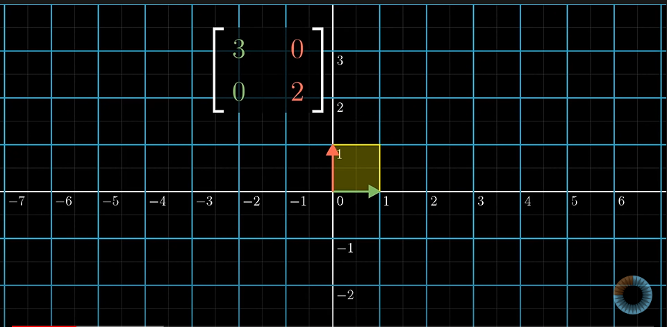
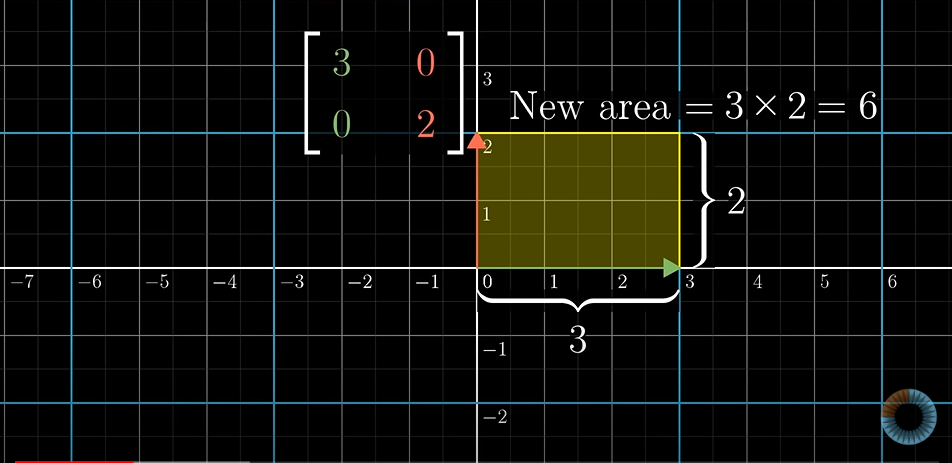
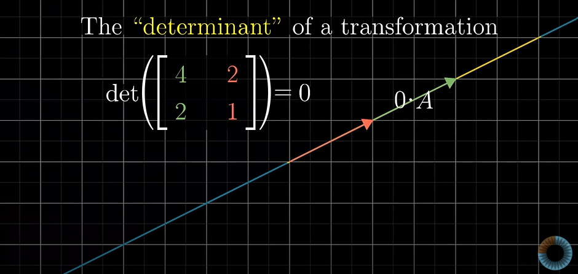
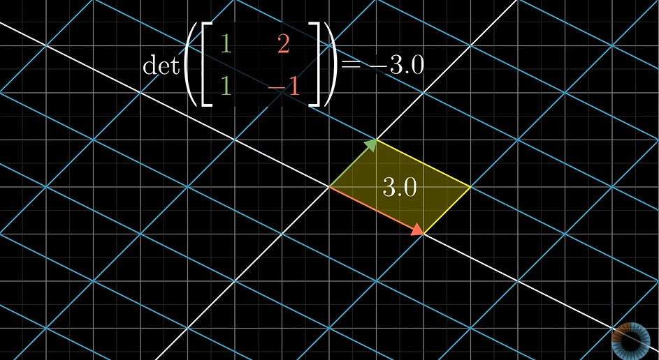
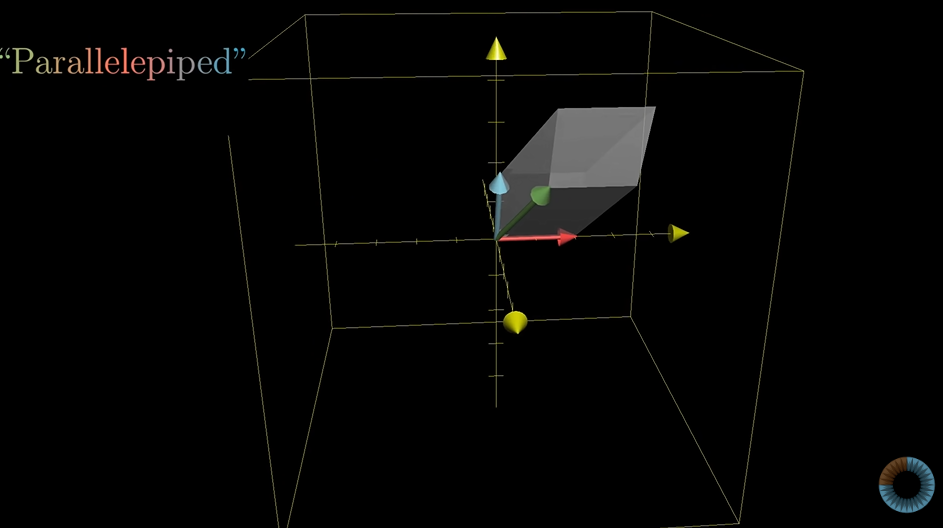
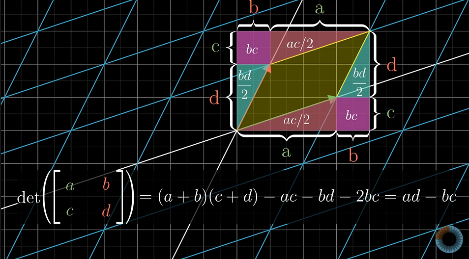
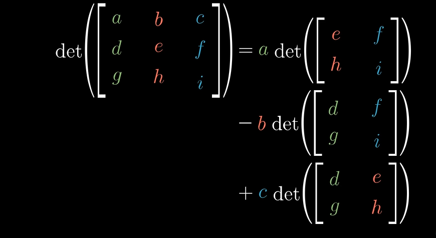

# Determinant

Linear transformation leads to scaling of area boumded in a region.

**Determinant** of a transformation is the scaler factor by which the the linear transformation changes any area.  

Determinant is zero if it squishes the area of any region to zero.

negative determinant means linear transformation flips the region whose area is to be calculated. Flipping means if originally j hat is to the left of i hat then after linear transformation , it will come to the right of i hat.

In 3-Dimensions , determinant rpresents the volume enclosed within the parallelopiped.

If determinant is zero, means the linear transformation squishes the region into a line , a thin plane or a single point.

If determinant is negative , left hand rule will be followed instead of right hand rule which was originally followed.

General formula for 2-D

General formula for 3-D

