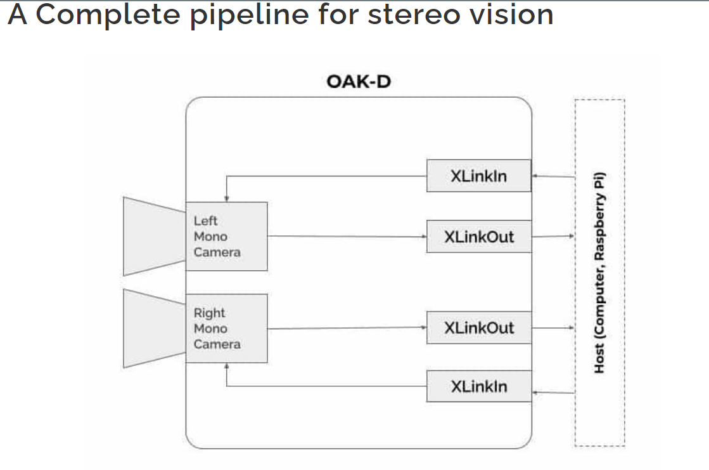

OAK—D (OpenCV AI Kit) is a spatial AI powerhouse, capable of simultaneously running advanced neural networks while providing depth from two stereo cameras and color information from a single 4K camera in the center.

*What is Spatial AI?*

Spatial AI is the ability of a visual AI system to make decisions based on two things
  1) Visual perception
  2) Depth perception

*Software/Hardware installations*

OakD camera does not require any external hardware/software installations.

It has integrated hardware, firmware, and software resulting in a seamless experience. 

**Depth-AI** is the API (Application Programming Interface) through which we program the OAK-D.

Application Programming Interface is a software intermediary that allows two applications to talk to each other

Depth AI does not depend on the os and is compatible with any operating system.

Depth AI installation:

  1)git clone https://github.com/luxonis/depthai.git
  
  2)cd depthai
  
  3)python3 install_requirements.py
  
  4)python3 depthai_demo.py
  
  [DepthAI installation](https://www.youtube.com/watch?v=nRPYWzUe-D0&list=PLfYPZalDvZDLOjzSkoHQ2_h4joHNUegbB&t=53s)
  
  **Depth AI pipeline
  
  A node is a unit with some inputs and outputs.
  
  A pipeline is a collection of nodes.
  
  
  
   1) Crete a pipeline
         
         We here are instantiating the pipeline object. 
            
            1)import depthai as dai
            2)pipeline = dai.Pipeline()
         
   2) Create the camera node
       
         We create the mono camera node. It does not do anything visually. It just recognizes the mono cameras.
         
            	mono = pipeline.createMonoCamera()
   3) Select the camera

         To access a camera, in our case the left camera, we need to select it. Which is done by the setBoardSocket method. Internally it also creates an input node, X-LinkIn. X-Link is a mechanism using which the camera communicates with the host ( computer ).  
         
              mono.setBoardSocket(dai.CameraBoardSocket.LEFT)
              
   4)Create XLinkOut node and acquire frames
   
   To get the output, we need to create the X-Link output node
          
   The camera can have several other outputs, say another stream from the right mono camera or from the RGB camera or some other output that we don’t need to worry about as of now. Hence, it has been named as “left” so that it does not conflict with others.

   Finally, we link the output of the mono camera by putting it as an input to the X-LinkOut node.

   
              xout = pipeline.createXLinkOut()
              xout.setStreamName("left")
              mono.out.link(xout.input)

All these commands run inside the host computer
