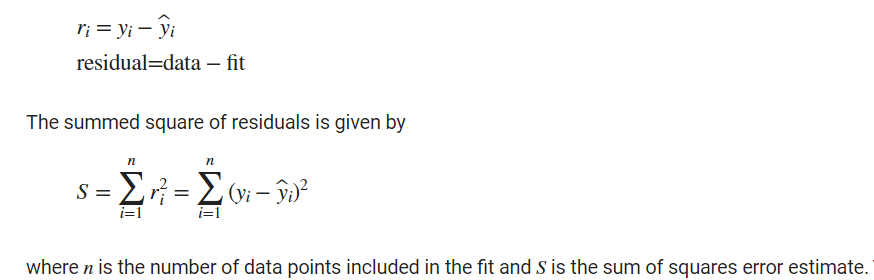
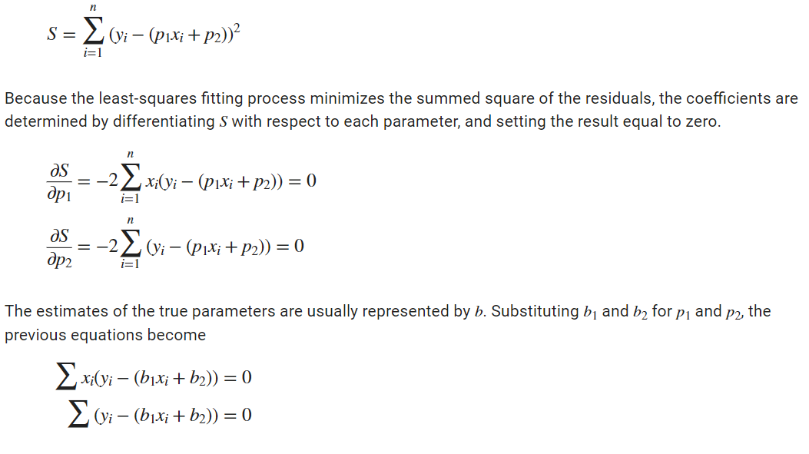
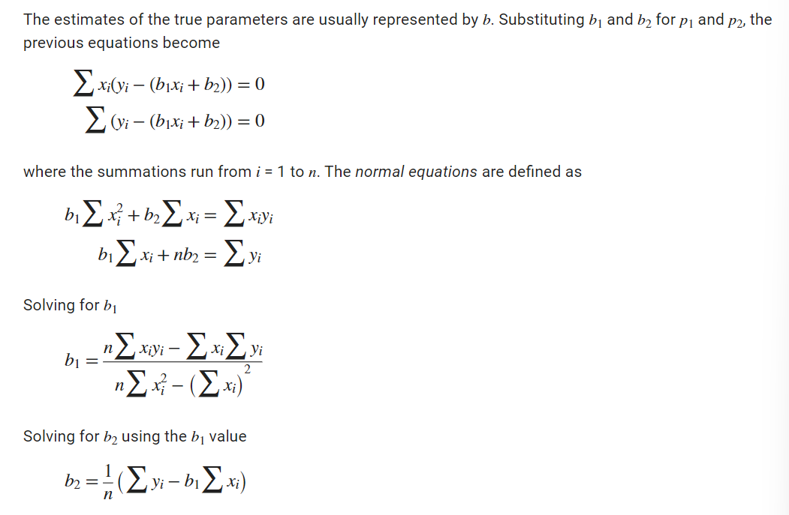
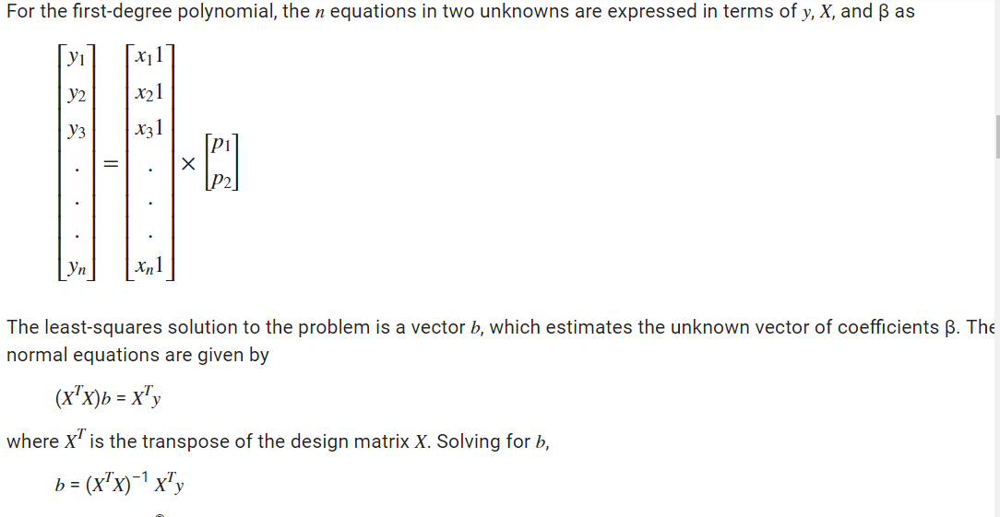
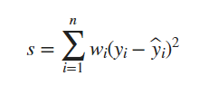
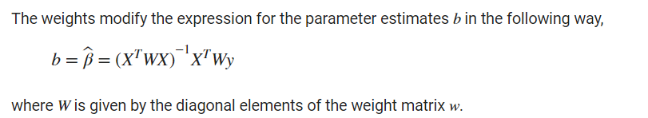
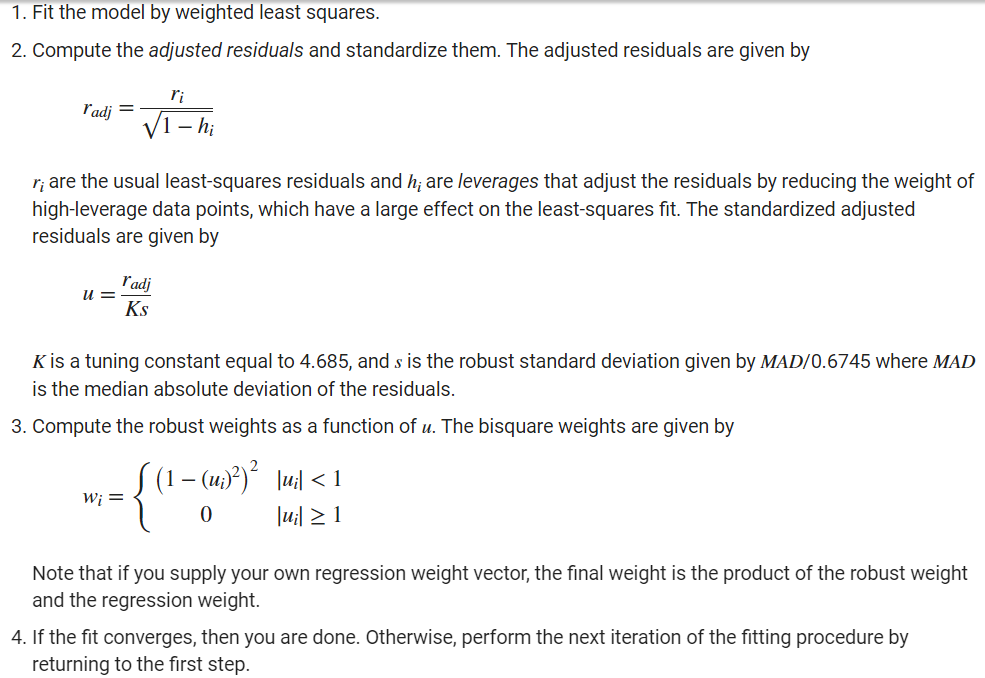
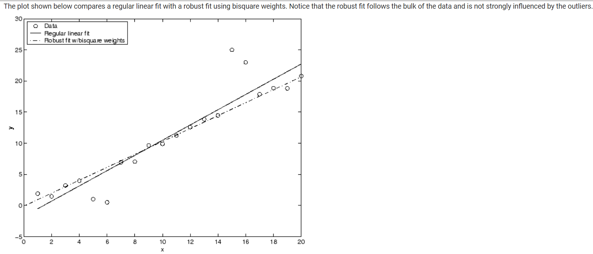

# Least-Squares Fitting

The least-squares method minimizes the summed square of residuals. The residual for the ith data point ri is defined as the difference between the observed response value yi and the fitted response value ŷi, and is identified as the error associated with the data.

where n is the number of data points included in the fit and S is the sum of squares error estimate. The supported types of least-squares fitting include:

**Linear least squares**

**Weighted linear least squares**

**Robust least squares**

**Nonlinear least squares**

There are two important assumptions that are usually made about the error:

The error exists only in the response data, and not in the predictor data.

The errors are random and follow a normal (Gaussian) distribution with zero mean and constant variance, σ2.

If the mean of the errors is zero, then the errors are purely random. If the mean is not zero, then it might be that the model is not the right choice for your data, or the errors are not purely random and contain systematic errors.

A constant variance in the data implies that the “spread” of errors is constant. Data that has the same variance is sometimes said to be of equal quality

## Linear Least Square

A linear model is defined as an equation that is linear in the coefficients.

y=p1x + p2

error is given by:

In matrix form, linear models are given by the formula

y = Xβ + ε

where

y is an n-by-1 vector of responses.

β is a m-by-1 vector of coefficients.

X is the n-by-m design matrix for the model.

ε is an n-by-1 vector of errors.

*Use the MATLAB® backslash operator (mldivide) to solve a system of simultaneous linear equations for unknown coefficients. Because inverting XTX can lead to unacceptable rounding errors, the backslash operator uses QR decomposition with pivoting, which is a very stable algorithm numerically. Refer to Arithmetic Operations for more information about the backslash operator and QR decomposition.*

You can plug b back into the model formula to get the predicted response values, ŷ.

ŷ = Xb = Hy

H = X(X^TX)–1 X^T

A hat (circumflex) over a letter denotes an estimate of a parameter or a prediction from a model.

The residuals are given by

r = y – ŷ = (1–H)y

## Weighted Least Squares

It is usually assumed that the response data is of equal quality and, therefore, has constant variance. If this assumption is violated, your fit might be unduly influenced by data of poor quality. 

To improve the fit, you can use weighted least-squares regression where an additional scale factor (the weight) is included in the fitting process. Weighted least-squares regression minimizes the error estimate

The weights you supply should transform the response variances to a constant value. If you know the variances of the measurement errors in your data, then the weights are given by

wi = 1/σ^2i

Or, if you only have estimates of the error variable for each data point, it usually suffices to use those estimates in place of the true variance. If you do not know the variances, it suffices to specify weights on a relative scale. Note that an overall variance term is estimated even when weights have been specified. In this instance, the weights define the relative weight to each point in the fit, but are not taken to specify the exact variance of each point.

For example, if each data point is the mean of several independent measurements, it might make sense to use those numbers of measurements as weights.

## Robust Least Squares

Extreme values called outliers do occur.The main disadvantage of least-squares fitting is its sensitivity to outliers.

To minimize the influence of outliers, you can fit your data using robust least-squares regression.

**Least absolute residuals (LAR)** — The LAR method finds a curve that minimizes the absolute difference of the residuals, rather than the squared differences. Therefore, extreme values have a lesser influence on the fit.

**Bisquare weights** — This method minimizes a weighted sum of squares, where the weight given to each data point depends on how far the point is from the fitted line. Points near the line get full weight. Points farther from the line get reduced weight. Points that are farther from the line than would be expected by random chance get zero weight.

## Nonlinear Least Squares

In matrix form, nonlinear models are given by the formula

y = f(X,β) + ε

where

y is an n-by-1 vector of responses.

f is a function of β and X.

β is a m-by-1 vector of coefficients.

X is the n-by-m design matrix for the model.

ε is an n-by-1 vector of errors.

Nonlinear models are more difficult to fit than linear models because the coefficients cannot be estimated using simple matrix techniques. Instead, an iterative approach is required that follows these steps:

Start with an initial estimate for each coefficient. For some nonlinear models, a heuristic approach is provided that produces reasonable starting values. For other models, random values on the interval [0,1] are provided.

Produce the fitted curve for the current set of coefficients. The fitted response value ŷ is given by

ŷ = f(X,b)

and involves the calculation of the Jacobian of f(X,b), which is defined as a matrix of partial derivatives taken with respect to the coefficients.

Adjust the coefficients and determine whether the fit improves. The direction and magnitude of the adjustment depend on the fitting algorithm. The toolbox provides these algorithms:

Trust-region — This is the default algorithm and must be used if you specify coefficient constraints. It can solve difficult nonlinear problems more efficiently than the other algorithms and it represents an improvement over the popular Levenberg-Marquardt algorithm.

Levenberg-Marquardt — This algorithm has been used for many years and has proved to work most of the time for a wide range of nonlinear models and starting values. If the trust-region algorithm does not produce a reasonable fit, and you do not have coefficient constraints, you should try the Levenberg-Marquardt algorithm.

Iterate the process by returning to step 2 until the fit reaches the specified convergence criteria.

You can use weights and robust fitting for nonlinear models, and the fitting process is modified accordingly.

[Example code at bottom of page](https://in.mathworks.com/help/curvefit/least-squares-fitting.html)