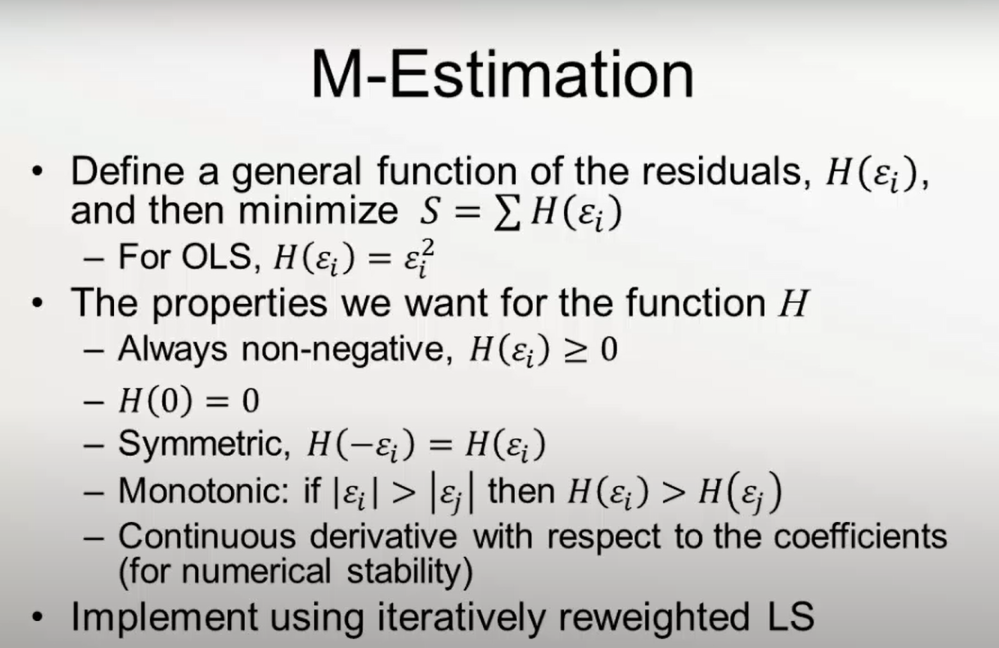
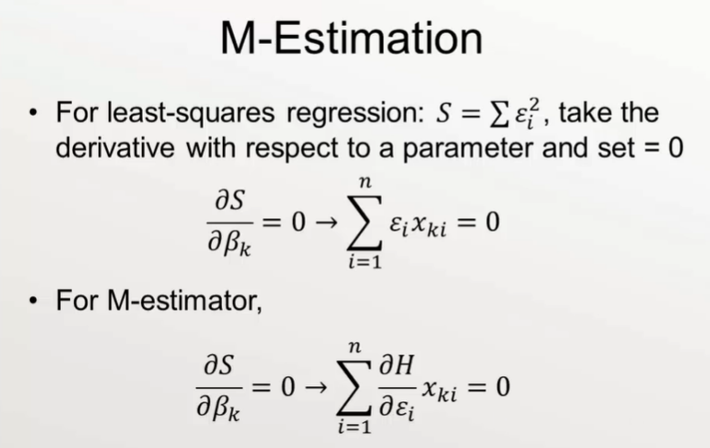
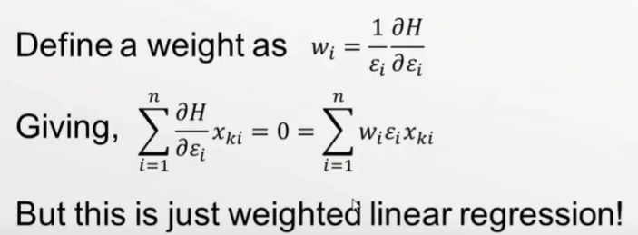
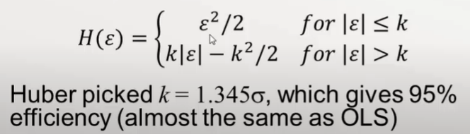
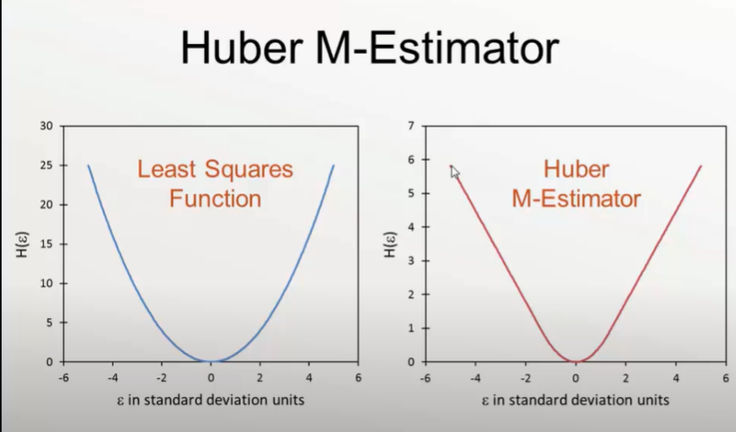
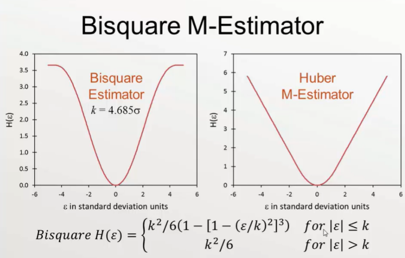
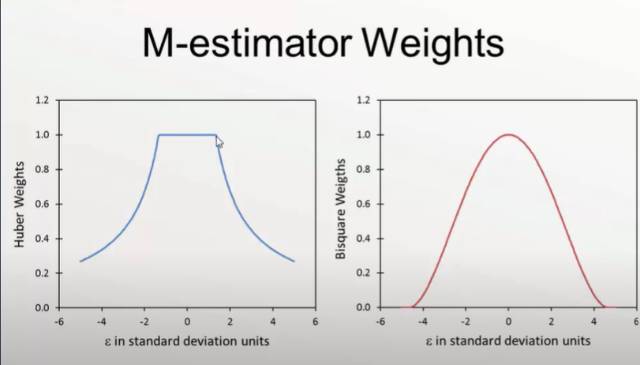

# Robust Regression

Outliers contaminate our best line. Hence our output data must be manipulated such that the effect of ouliers is minimized. Here coes into picture, robust regression.

## Least absolute deviation

Instead of minimizing the square of absolute differences , we minimize the absolute value of differencess.

Hence the outlier errors are not squared and have a lesser effect

One of the problems, this function is discontinuous at origin. Hece our normal method of taking the derivative as zero at the origin fails and we need to adopt different approaches to minimize this error.One such method is linear programming but his does not produce a unique soln.

LAD is Maximum Likelyhood Estimation

## M-Estimation

Now we follow a procedure: 

1) Guess the weights, fits

2) Calculate the residuals

3) Use those residuals to calculate new weights

4) Repeat until Convergence

## Huber M-Estimator

This method tends to apply both the least-Square estimator and the absolute deviation estimator

The residuals are studentized using Median Absolute Deviation

## Bisquare M-Estimator

This an improvement over the Huber M-Estimator

After a certain standard away from the mean, the weighting becomes a constant

*A way to look at these through graph of M-estimator Weights*

## ROBUSTNESS OF M-ESTIMATOR

Bisquare estimator is a good method but suffers from Local Minima Problem.The Huber M-Estimator gives a unique soln.

Hence we often use the Huber M-esimator as a starting point for the biquare estimator.

Both M-estimators and LAD can tolerate large deviations in Y as long as they dont have large deviations in X.

To tackle this we introduce:

## **Bounded Influence Regression**
 
**Least Trimmed Squares**: deletes some percentage of the most extreme residuals and then performs Ordinary Least Squares on the rest.
 
    - Does not work well for small Sample sizes

**Least Median Squares**: minimizes the median of the squared residuals

    -Very robust , but very low efficiency
