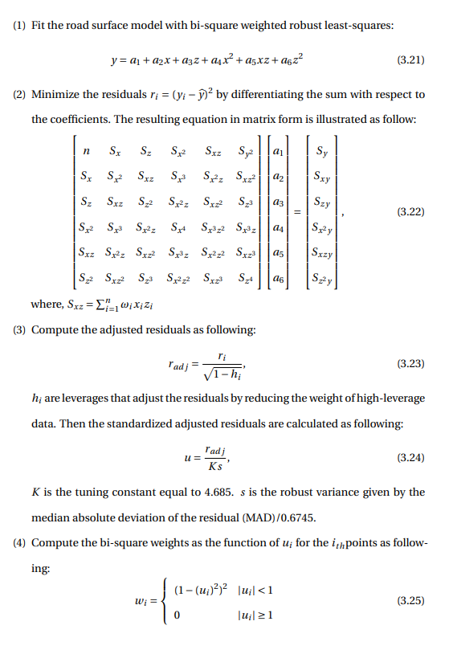

# Road surface Fiiting

With all the 3 dimentional world coordinates points, we can fit the road surface using bi-square weighted robust least-squares method.

The quality of all points is considered equal when fit to a road surface.

Pothole points below the road surface infulence the accuracy of the fitted road surface.

The bi-square weighted robust least-squares method used in this road pothole detection system minimum the outliers'influences during the fitting processes by add an additional scale factor (the weight).

If the fit converges, then we are done. Otherwise, calculate the next iteration of the fitting processes from the first step until it converges.

Doubt: What is meant by if the fit converges?