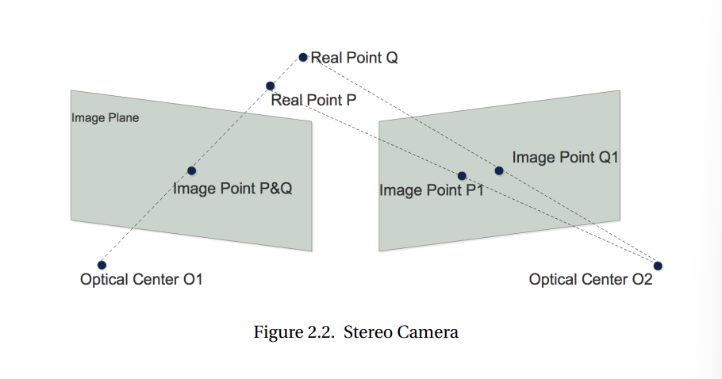
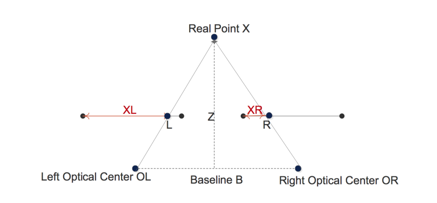
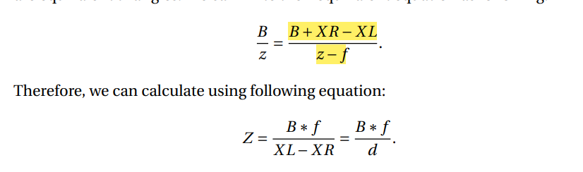

# 2 Background

We use computer stereo vision based methods to detect potholes on
road surfaces. 

We are able to obtain the depth by means of triangulation, if we can find the corresponding pixels in the stereo image pairs.

let Real point Q be written as real point x , optical center O1 be Left Optical center OL , optical center O2 be right Optical center OR with the distance between the two being Baseline B. Let image point Q and Q1 be represented by L and R.

XL is the distance betwen the leftmost point and the image in the left image plane.

XR is the distance betwen the leftmost point and the image in the right image plane.

Hence disparity between them is:

    d= XL-XR

Z represent the depth of the object and  f is the focal length obtained from stereo camera calibration.

Triangle X-OL-OR and triangle X-L-R are similar

hence,

Z is the depth of point X, and it is inversely proportional to the disparity.So once we find the corresponding points in the stereo image pairs, we can calculate the disparity and the depth of a real point on roads correctly.

Before calculating the best two corresponding points, rectification is done first.

Rectification includes removing the lens distortion and turning the stereo image pairs in standard form.

To carry this out, we use the semi-global Matching algorithm proposed by Heiko7 which is provided in OpenCV.

Given the disparity map and stereo camera parameters, the corresponding coordinates in 3 dimensional coordinate system can be calculated.

Given all 3D points in an image, a road surface can be fitted using the bi-squares weighted robust least-squares algorithm.

All outliers then can be labelled as road potholes.

We use connected component labelling algorithm to label different road potholes into different numbers.
