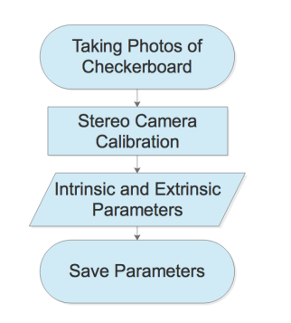
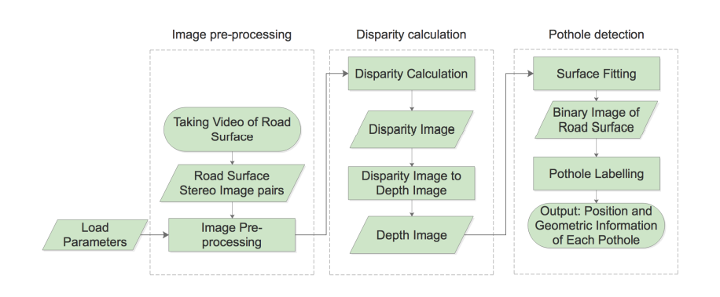

# Approach to Pothole Detection System

The proposed system consists of 2 modules: off-line processing and on-line processing.

Intrinsic parameters such as the stereo camera parameters like focal length and left and right camera center as well as Extrinsic parameters are obtained using a checkerboard based on Zhang's camera caliberation method.

these contibutes to the off-line processing.

The online flowchart is:

Before transferring the image coordinates to the world coordinates , some preparation work needs to be done.

The images taken by the two cameras shuld be undistorted and rectified which transforms images to compensate for lens distortion and project image pairs on to a common image plane respectively.

The rectified and undistorted image pairs are used to calculate disparity map with the stereo camera parameters obtained earlier using the **semi-globl matching algorithm**.

Image points are transferred to world points using the disparity map.

The road surface is fitted using the **bi-square weighted robust least-squares algorithm** with all the 3-dimensional points of road surface.

All points below the road surface correspond to the pothole region.

Pothole points are labelled into different potholes according to their connections using the **connected component labelling algorithm**.