# Epipolar Geometry

Epipole: The intersection of line joining the origin of one camera with the origin if the other camera is known as epipole.

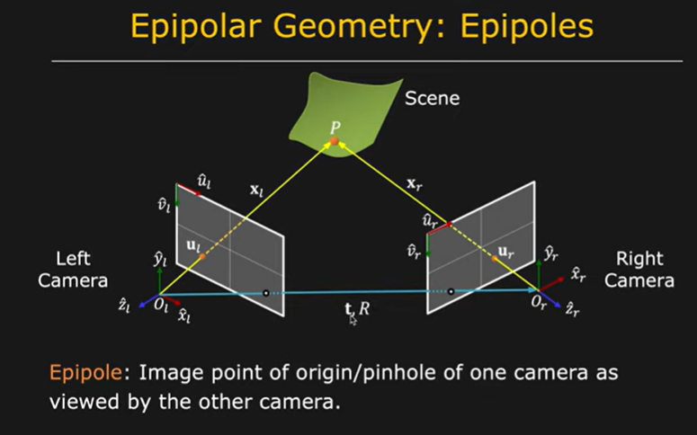

Epipolar plane

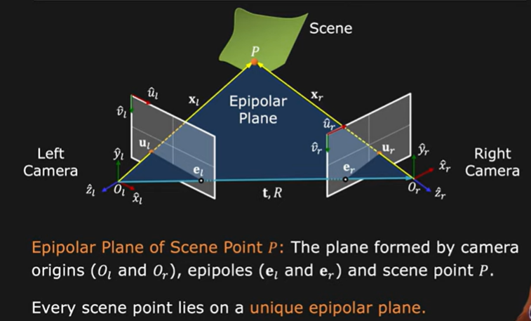

there is a vector that is perpendicular to the epipolar plane

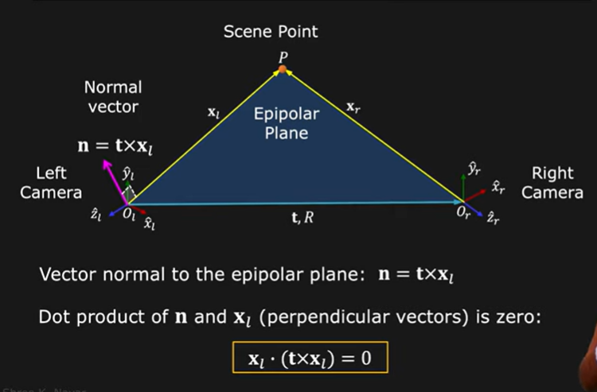

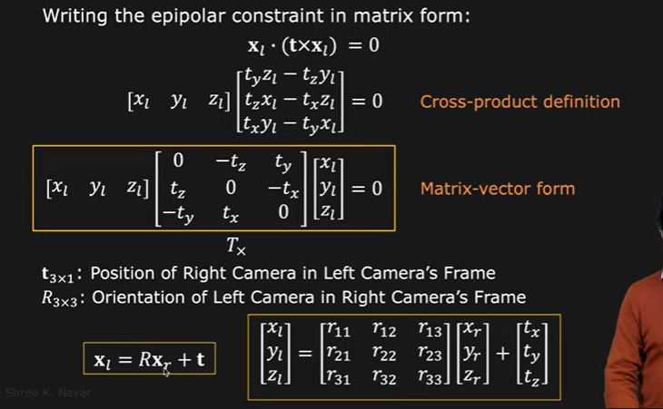

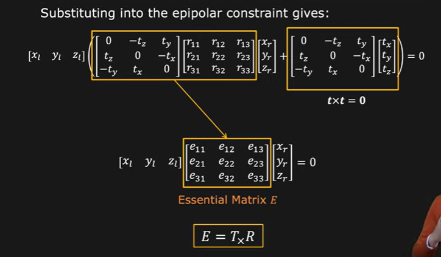

Important property of essential matrix is that we can decompose it into translational matrix and rotational matrix

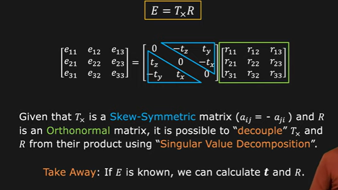

How do we find E?

We find coordinates of object in the left camera and in the right camera

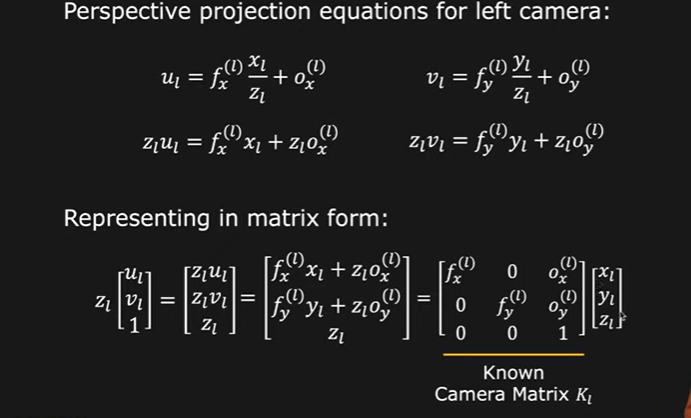

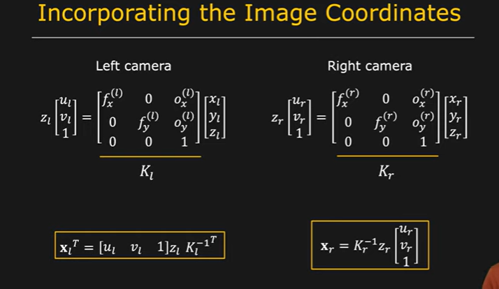

We substitute this in the epipolar constraint

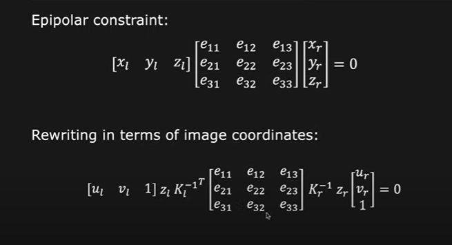

zl and zr are depth of object throgh the left and right camera.

However , for any point in the world until nd unless it lies on the camera , it is not zero.Hence we can eliminate them!

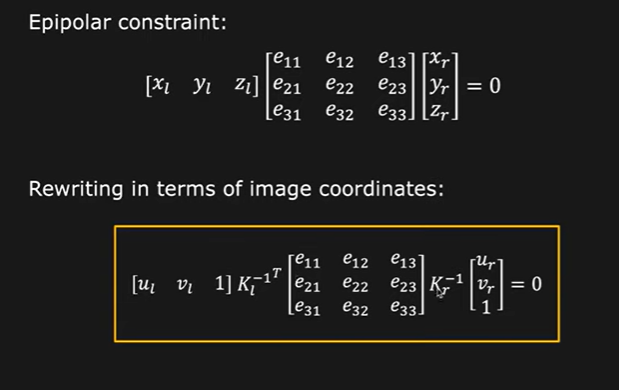

kl and kr are 3 by 3 matrix and hence product of all the matrices is another 3 by 3 matrices which is zero.

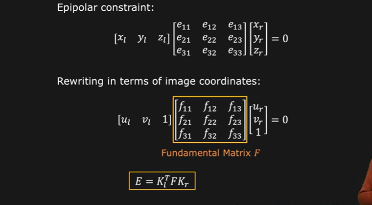