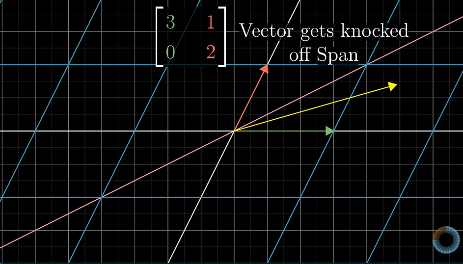
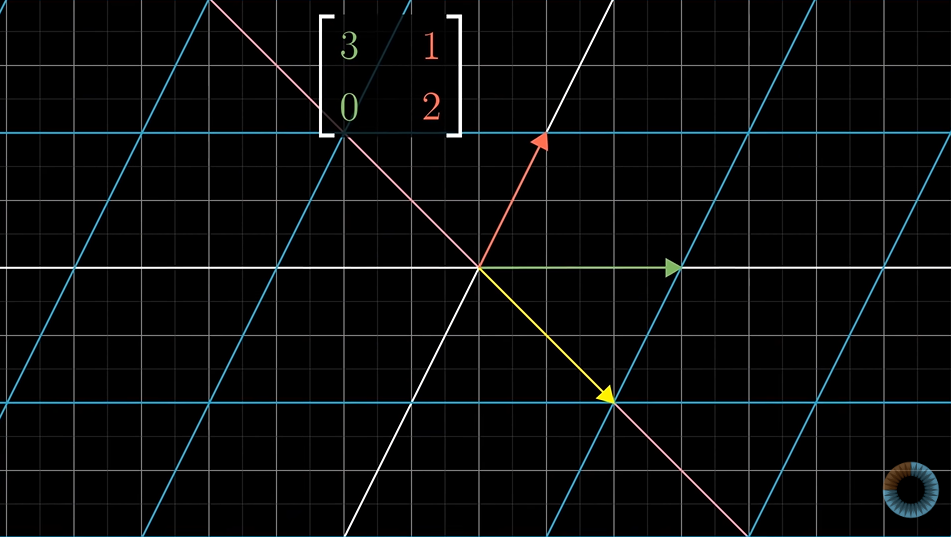
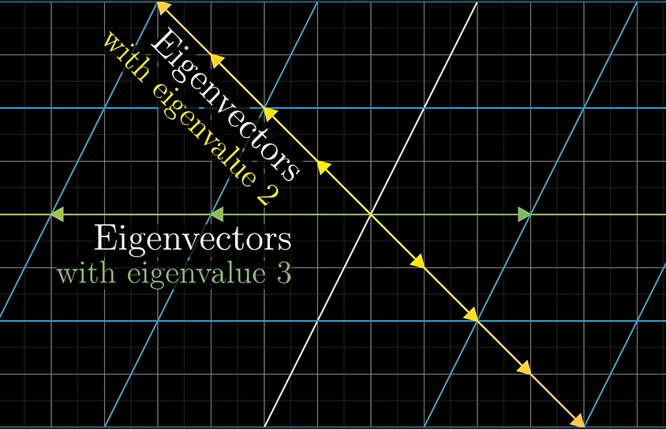
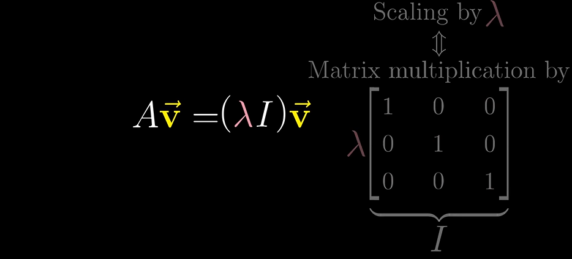
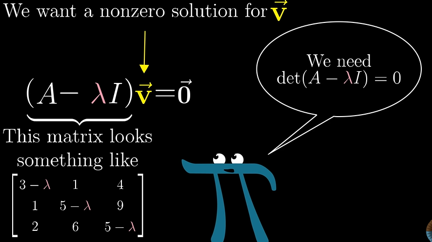
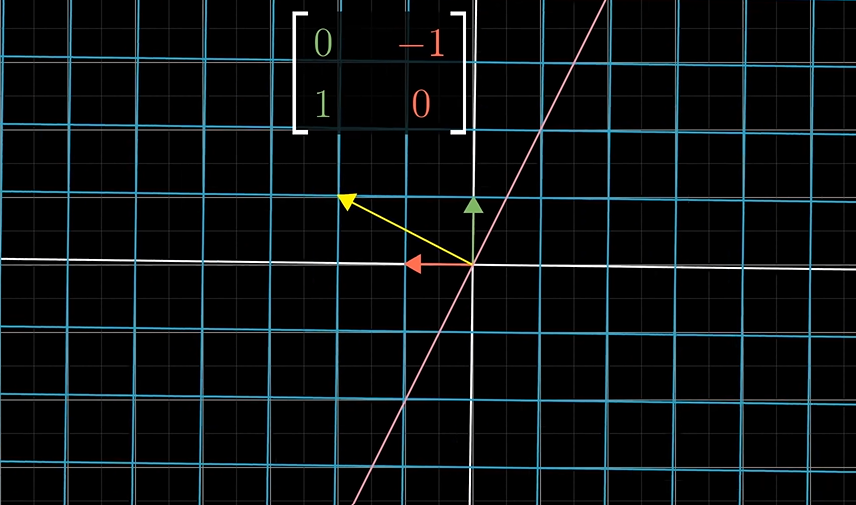
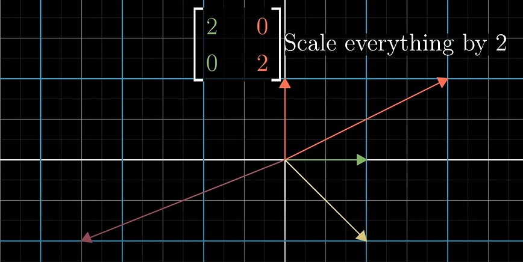
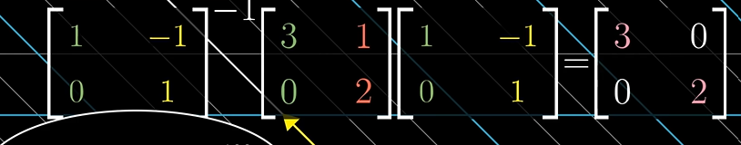

# Eigenvectors and Eigenvalues

When linear transformation is applied on a 2d space , various vectors get knocked of thier span.

However certain vectors maintain thier span and are only scaled.

These special vectors are kknown as the **Eigenvectors** with thier own **Eigenvalue** representing the ammount by which it is scaled.

Eigenvalue negative means that the vector is flipped and scaled.

Computation:

Therefore the transformation associated with the vector squishes it to a line for product to be zero.

Having Eigenvectors is not necessary!

Also we have a single Eigenvalue for multiple Eigenvectors.

**Eigenbasis**: if the basis vectors i a coordinate system is its eigenvector , the basis vectors are called Eigenbasis.

ex:

In cases like these we first change the basis vectors to Eigenbasis then carry out the computation and then convert back to our standard system as we are sure to get a diagonal matrix after conversion and it is much easier to work on this matrix.

But for this , there must be enough number of Eigen vectors possible.
