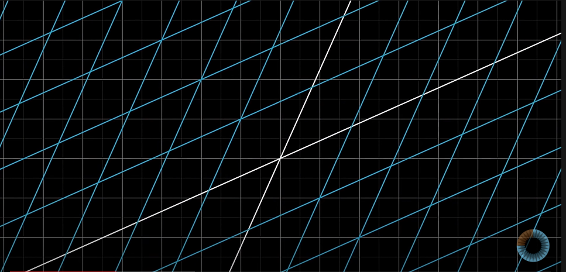
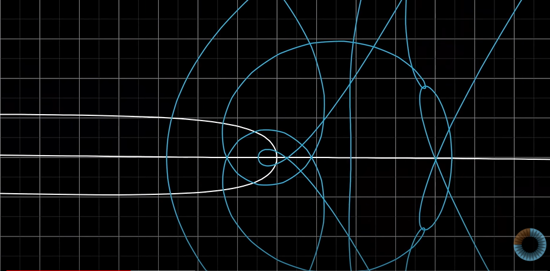
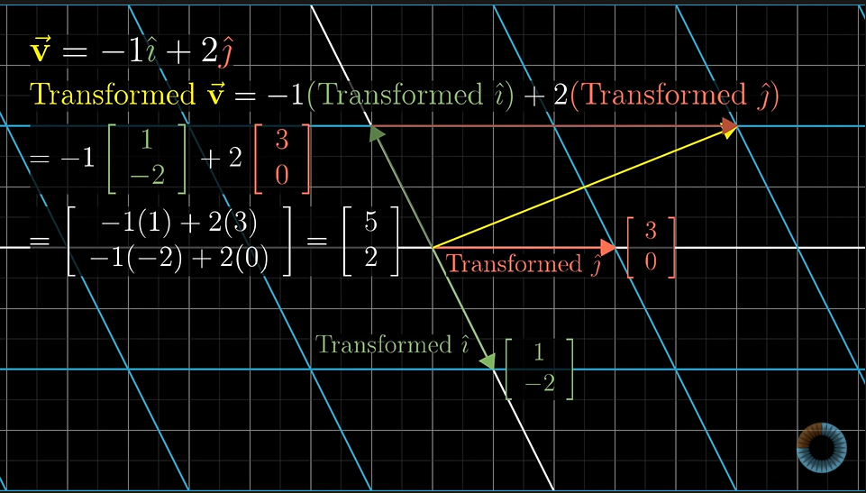
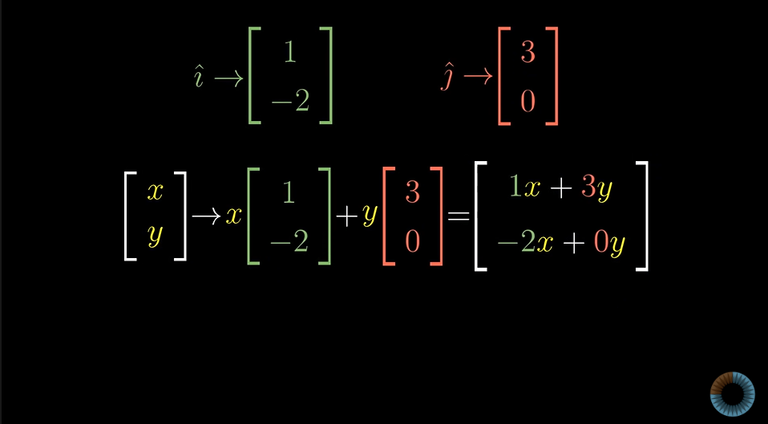
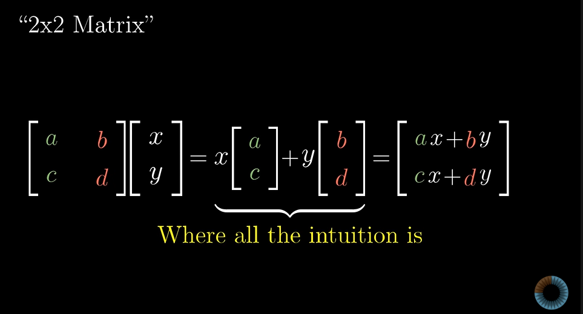
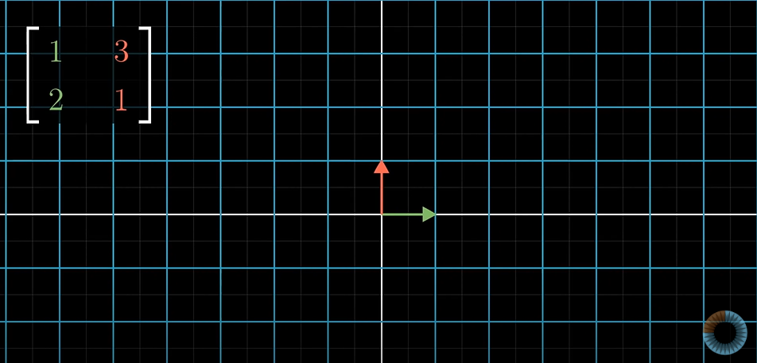
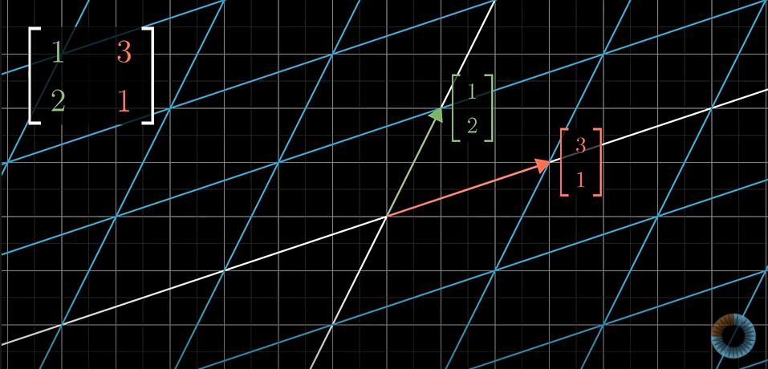
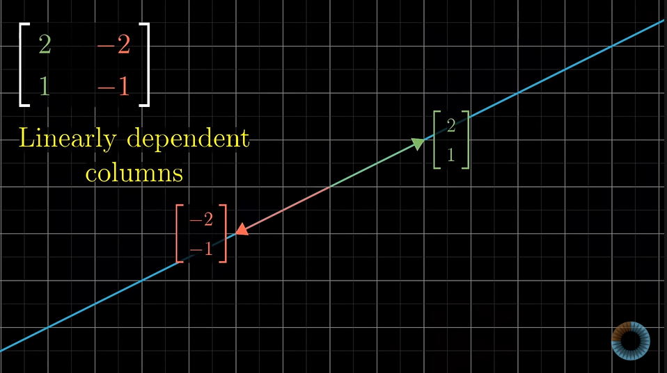
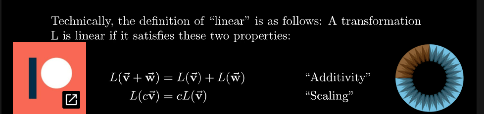

# Linear transformation and Matrices notes

 Transformations are **functions** performed on vectors
 
 take in a vector and soit out another vector.
 
 Function on vectors lead to some sort of movement on it.Hence the term **Transformation** 

When input vector is converted to some output vector , all points in space are moved to some other points. 

linear algebra are limited to **linear transformations**.

## Linear Transformation 

all lines must remain lines with no curves;grid lines parallel and evenly spaced

Origin must remain fixed

what should be the formula to deduce the new vector position.

the new vector position can be deduced based on where i hat and j hat land after transformation.

general representation

most general rep == scalar matrix multiplication

ex

**Linearly dependent vectors**

if the vectors on which i hat and j hat land on are linearly dependent that is one is the scaled version of the other , the transformation squishes the two vectors into a single line i.e. on the one dimensional span of the two linearly dependent vectors

