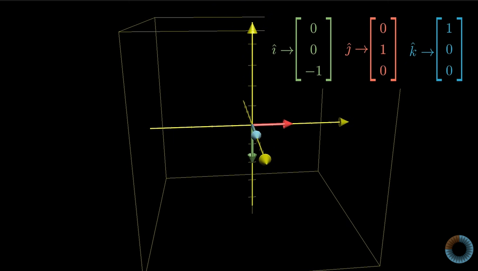
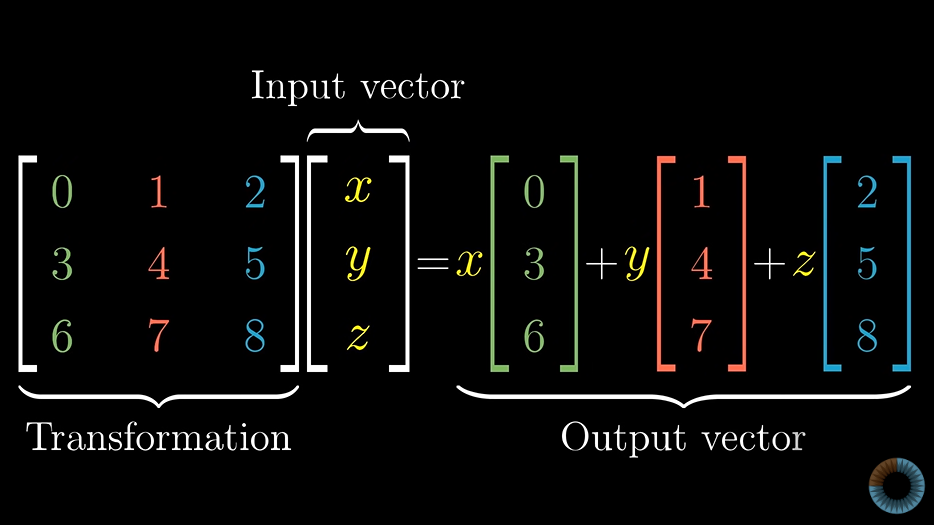

# Three dimensional linear transformation

Rules of Linear Transformation followed:
    1. all lines are parrallel and evenly spaced
    2. origin is fixed

Position of final transformed vector can be represented by tracking the coordinates where the three basis vector lands. The coordinates can e represented as 3 dimensional matrix.

simple 3-dimensinal rotational matrix

General representation of three dimensinal rotation matrix

