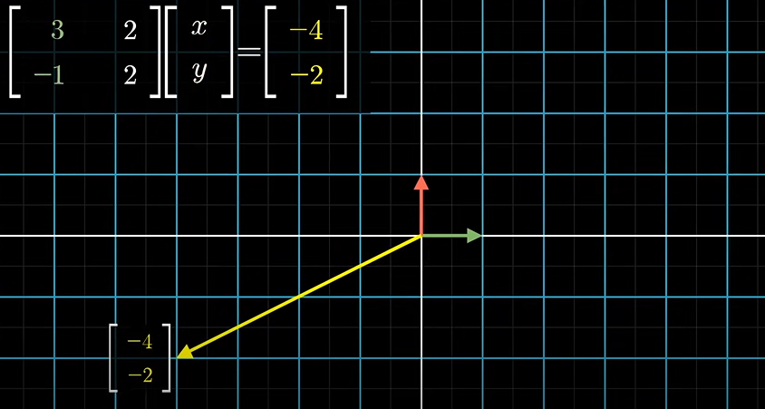
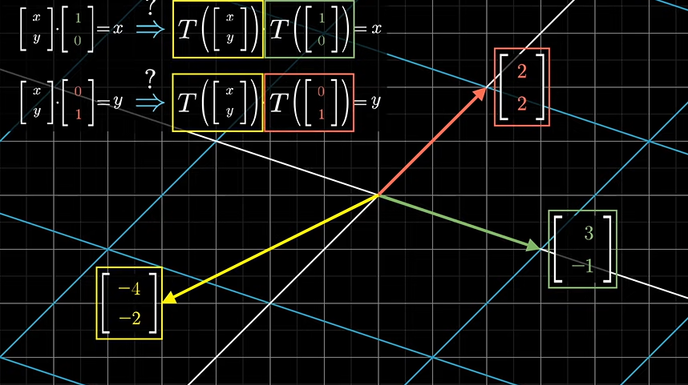
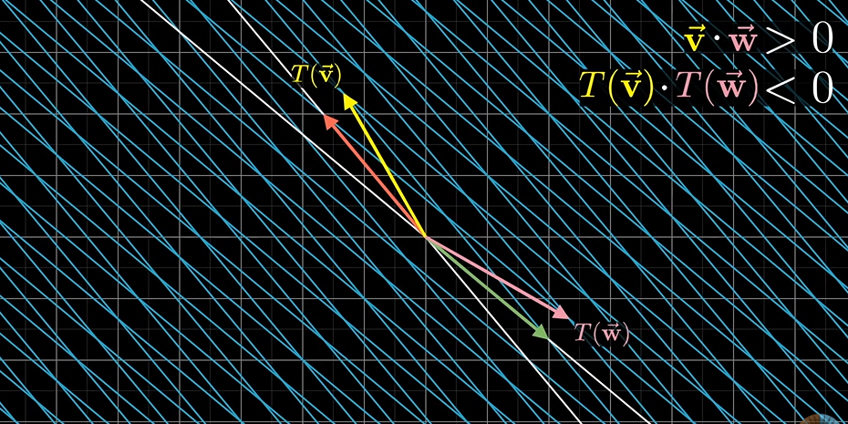
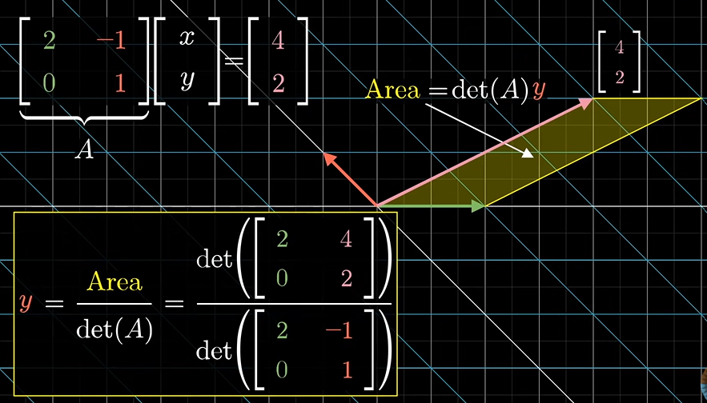
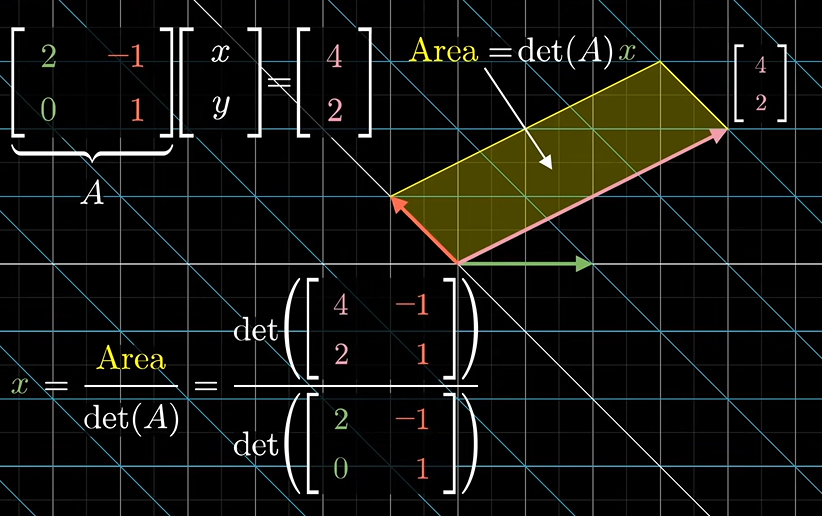
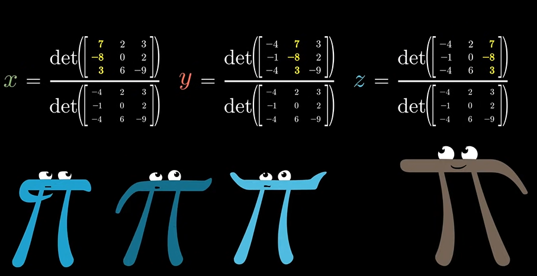

# Cramer's rule

here we have a sort of puzzle as in which input vector x y will land on vector [-4 -2] (vertical) when the liear transformatiokn is performed.

To find the input vector, we take the respective projection of transformation of this vector about the transformation matrix on the transformed x and transformed y axis.

This is mathematically wrong as during most linear transformaation the dot product between two matrices changes. 

**The transformation that does preserve dot products have a special name and are called ORTHONORMAL transformation**

In orthonormal transformation the basis vectors after transformation are perpemdicular to each other.Hemce dot products are preserved.

This super specific cases forces us to think about a alternative geometric views of x and y that remain unchanged after every Transformation.

Consider a parrallelogram encloseed by the unknown vector and the unit vector aloteng the x axis.
The area if this parallelogram is equa to the y coordinate of the unknown vector.

Now after applying a transformation about the given matrix the areas change. BUT the area of all region scales by the same amount!This amount is equal to the determinant of the rotation matrix.

Hence the signed area of the transformed vector and transformed unit x coordinate = (determinant of ratation matrix) times area of vector and x coordinate

similarly the x coordinate can be calculated.

This is CRAMER'S RULE

In case of 3d vectors amd 3d transformation 

We consider a parallelopiped with base as i hat and j hat and volume z.
We carry out linear transformation.
Now we calculate the signed volume of the resultant parallelopiped.
We know that the volume of all region in the original 3d space is scaled by a fixed amount which is equal to the determinant of the rotational matrix.

Hence the signed volume of the transformed vector and transformed unit x coordinate and transformed unit y coordinate = (determinant of rotation matrix) times volume of vector and unit x coordinate and unit y cordinate
