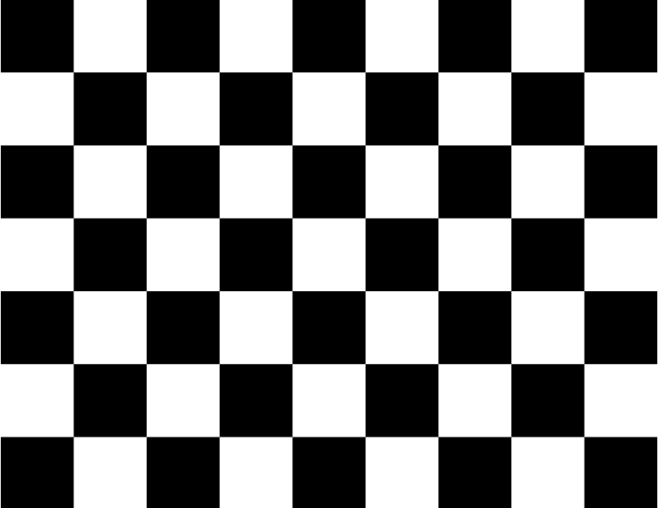
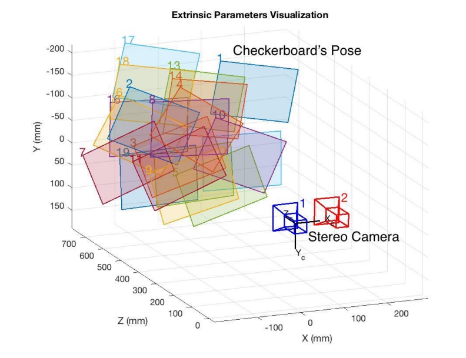
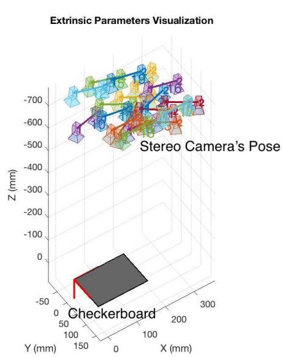
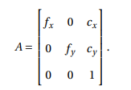
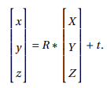
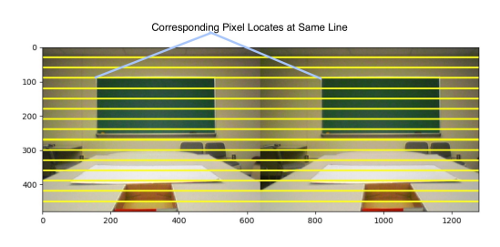

# Stereo Camera Caliberation

To find the intrinsic and extrinsic parameters of the camera we use stereo camera caliberation.

Two usb cameras are used to observe an 8×6 checkerboard with 24.5 mm squares.

Either two cameras or the checkerboard can be freely moved.

A minimum of two orientations are required for camera caliberation and a total of 20 are used for better quality.

The **Intrinsic parameters** (camera matrix) are **independent**.Therefore, once the ontrinsic parameters are determined, they can be used as long as focal length and camera position remains same.

The output camera matrix is :

fx and fy are focal length of the camera along the x axis and y axis respectively.

cx and cy are the center of the two images.

The **Extrinsic parameters** is the joint rotation-translation matrix.

Extrinsic parameters can translate a point (X, Y, Z) to the coordinate system with fixed camera.

R is the rotation matrix. t is the translation vector

The joint rotation-translation matrix Rt is the extrinsic matrix.

After caliberating the intrinsic and extrinsic parameters, removal of image distortion and rectification work should be done.

At this time, light correction can be added to remove the influences cased by lighting condition as well.

Hence stereo pairs are converted into standard form.

In this type of standard form image pairs , the corresponding point are at same horizonntal level in the two images.They are better for disparity calculation, because corresponding pixels remain in the same horizontal line would low the matching cost a lot when we calculate the disparity map