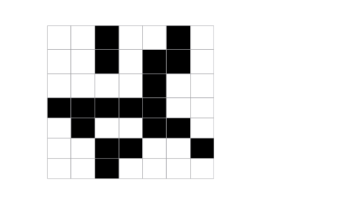
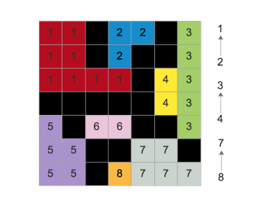
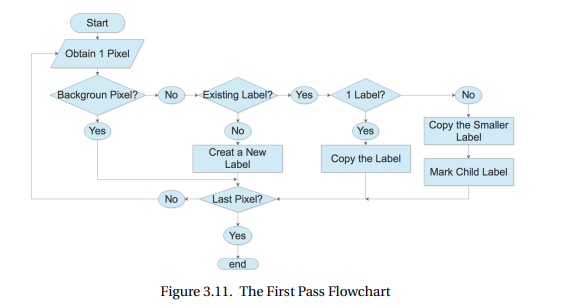
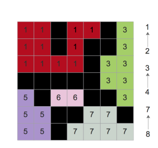
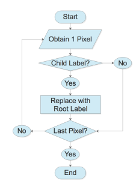

# Road Pothole Labellig

To identify multiple potholes in a region and label the detected pothole we use **Connected component labelling algorithm**

We start from the top-left pixel(1,1).

If this pixel is not background(black) and is not surrounded by any previously marked label , we assign it a fresh label 1.

Any pixel directly in contact with this pixel is automatically labelled 1 and any pixel in contact with those pixels are also and this process continues till the we encounter a background pixel.

If a pixel is surrounded by only a background pixel and no other previously labelled pixel, we assign it a fresh value say 2.

For a pixel surrounded by 2 pixels with different value, we consider the lower value. We note here that the larger label is child of the smaller label.

Wth this convention in mind, we move from left to right in rows and from top to bottom along columns.

eg:

Now we start the second pass of labelling the image.

We start at the top-left corner and check whether its label is a child of any other label.

If it is a child label, we replace the child label with the smaller label.

We do this for the entire image.

With the labelled potholes, we can easily calculate the distance from pothole to the car or the other geometric information of each pothole in the region of interests using the image in world coordinates.