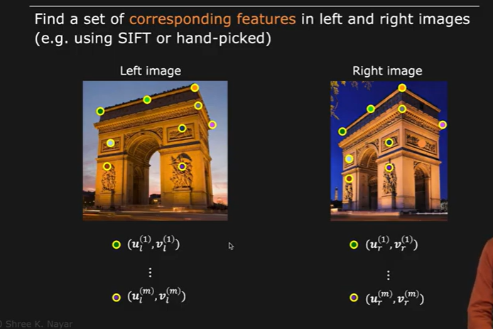
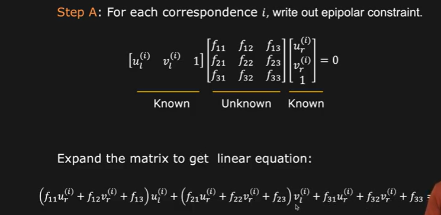
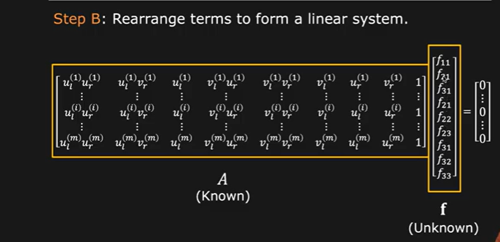
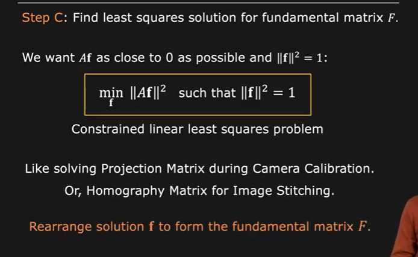
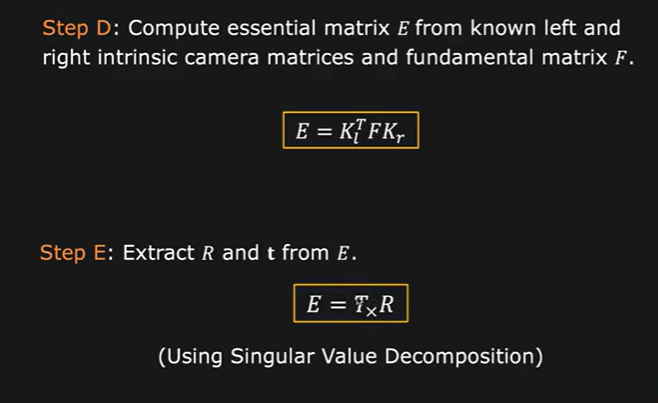
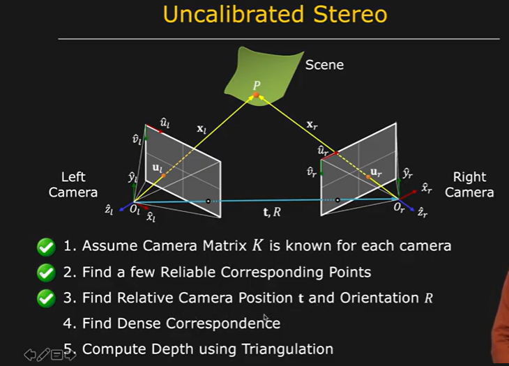

# Estimating Fundamental Matrices

We find a set of corresponding features in the left and right image.

if we multiply the fundamental matrix with k , we define the same epipolar geometry.

We solve this as we solved for Eigenvectors using function F and then use vector f to find the fundamental matrix F

Compute Essential matrix from fundamental matrix and from this we calculate the Rotational and Transpose of the matrix. 

Hence , our stereo system is fully caliberated.

