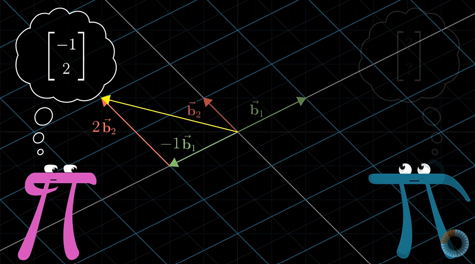
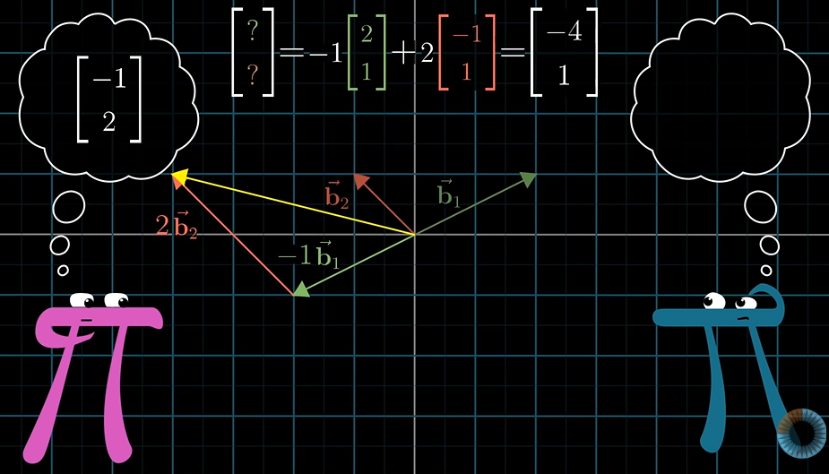
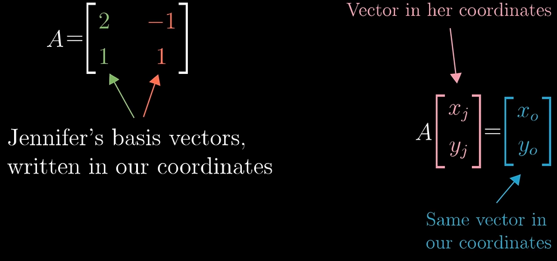
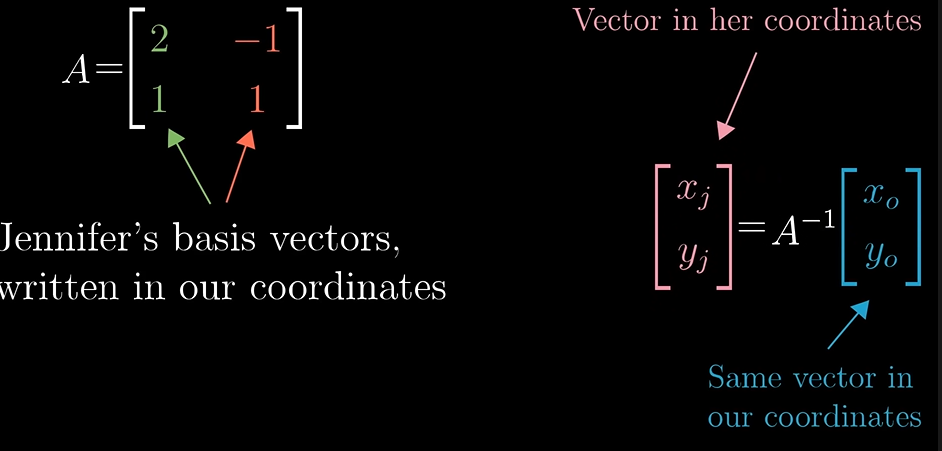
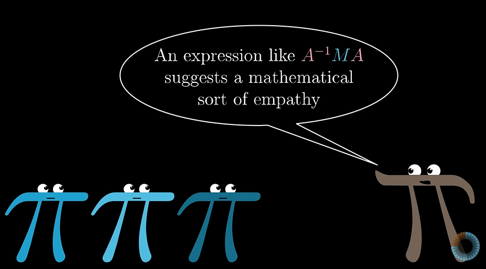

# Change of basis

For all coordinate system:
    1)Origin is always fixed
    2)Direction of axis and the spacing between the grid lines can be different

An arbitrary coordinate system and its interpretation in our coordinate system is represented below

Hence we can generalise the transformations between two coordinate systems as:

now how do we carry out rotation in a unconventional matrix system?

We first translate the vector in the unconvetional coordinate system to our coordinate system , then apply rotation on it and then again convert it back to the unconventional coordinate system.

middle matrix represents transformation of some kind and outer two matrices represent the empathy that is the shift in perspective.
