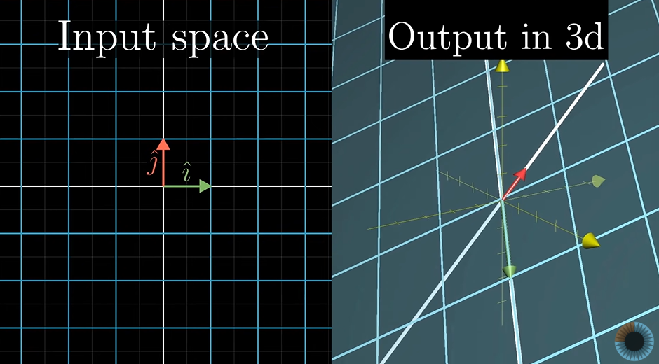
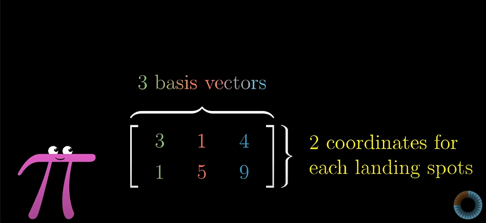
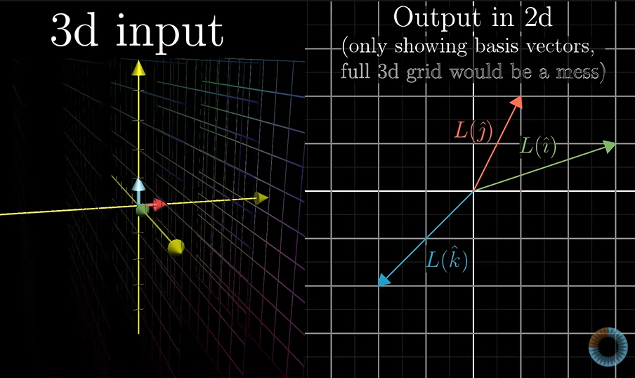
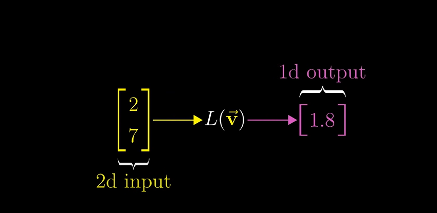
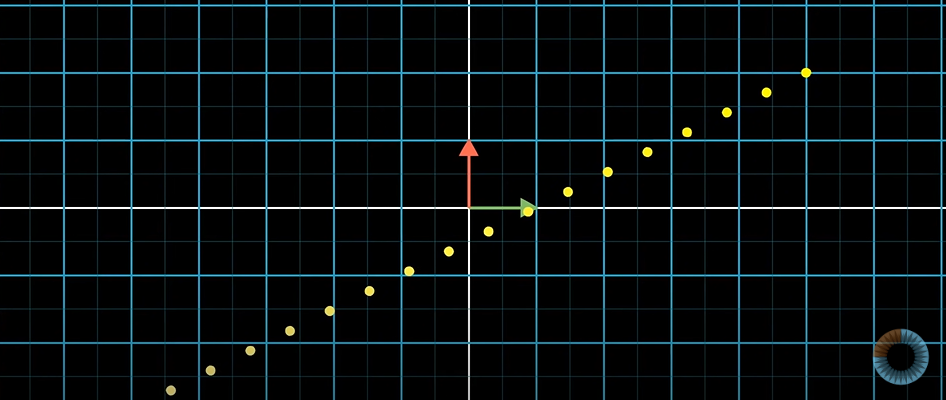
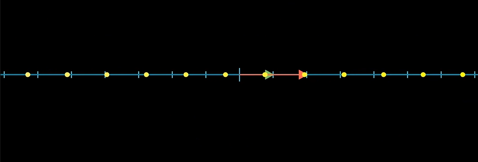

# Non-Squre matrices as transformations

 What happens in cases when a linear transformation is applied on a  2-d vector and a 3-D vector is generated?

 

 We use the same set of rules 

 The basis matrix i hat is transferred from its 2-d coeeficient to a point in 3-D space(the value of z changes fro 0 to a finite/infinite number).Similar transformation is carried out on j hat.

 Therefore the transformation matrix here must (for above example) a 3 cross 2 matrix.

 **The column space of this matrix is a 2d plane slicing through the origin of 3d space** This is still a full rank matrix the dimension 2 is the maximum dimension that give 2-d space can have.

 What about the case shown below?

 

 Here the 3 basis vector in 3-d are transferred to points in a 2-dimensional space.

 

 case 3:

 

 A transformation like this takes 2-d vectors and spits out numbers.

 A line of evenly spaced dots remain evenly spaced on 1 dimensional space.

 

 

 The transformation matrix is a 1 by 2 matrix where the two columns describe where the basis vectors land. 