# Stereo Processing

The stereo processing in this system uses The **Semiglobal Matching Algorithm**

## step 1: **Matching Cost Calculation**

The matching cost calculation is based on Mutual Information, which is insensitive to illumination changes

The Mutual Information of the stereo image pairs, MI_I1,I2 , is a measure of the mutual dependence between the two images. 
It is computed from the entropy H of the stereo image pairs:

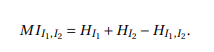

In case of stereo, the random variables are the image pixels we take from each image in a stereo pair. If we assume pixel values i are discrete random variables(RVs) with discrete probablity density P,then we can define the entropy H as 

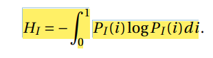

For a rectified image , the joint entropy is low.It is calculated from the probablity distributions P of intensities of the stereo image pairs.

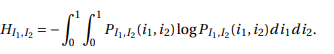

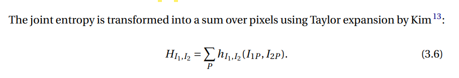

The term hI1,I2 is computed from the joint probability distribution PI1,I2 of corresponding intensities:

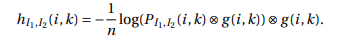

Where, n is the number of corresponding pixels, and ⊗g (i,k) indicates a 2D Gaussian convolution.

The probability distribution of corresponding intensities is defined with
the operator T[]. T[]=1 when argument is true else it is 0:

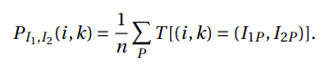

The single image entropy is calculated as:

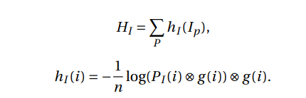

Where P is the intensity distribution, n is the number of corresponding pixels, and ⊗g (i) indicates Gaussian convolution.

Hence to conclude we can calculate the matching cost basing on Mutual information as shown in above equations.

## step 2: **Cost Aggregation**

The Semiglobal Matching Algorithm defines the energy E(D) that depends on the disparity image D also kown as disparity map:

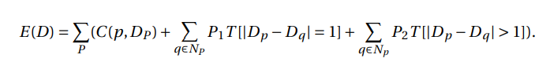

Where |Dp - Dq| is the difference of disparities at pixel P and pixel Q respectively.

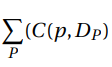 is the sum of all pixel matching costs.

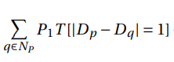 adds a constant penalty P1 for all pixels q in the neighborhood of p.

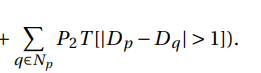 adds a larger constant penalty P2 for all larger disparity changes.

This process is **cost aggregation**.

The cost is aggregated into a cost volume by going into 8 directions through all pixels in the image.

The cost in the direction r of the pixel p at disparity d is calculated as:

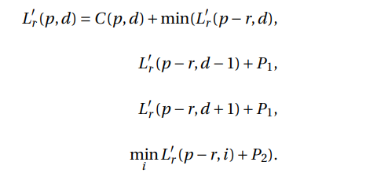

The value of L'r(p,d) always increase along the path. 

To avoid overflow, the minimum path cost is subtracted from the equation.

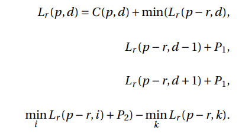    

Hence final cost of pixel p at disparity d is calculated a sum of all costs from all directions:

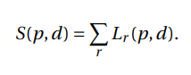

## step 3: **Disparity Calculation**

All the pixels in an image that corresponds to the minimum cost contribute to the disparity image.

For the stereo image
 pair, each disparity of Dr q (the disparity at pixel q in right image) is compared to its corresponding disparity of Dl p (the disparity at pixel p in left image). 

Dp = Dlp if |Dlp - Drq| <= 1

In all other case , disparity is said to differ mad be equal to Dinv which is D invalid.

Dp = Dinv

Doubt: What is meant by disparity at pixel q in left image and right image? 

If pixel p in left image correspond to pixel q in right image then the disparity is given as difference of x-coordinate of pixel p and pixel q.

Then naturally both pixel p and q will lie in at same positions in both image and hence disparity Dp = distance b/w pixel p and q?

## step 4: *Disparity Refinement*

The disparity map obtained above contains many error.

To eliminate them we can use intensity consistent disparity selection and discontinuity preserving interpolation.

The advantages of these methods are that they are independent of the used stereo matching method.

Besides these approaches, median filtering is useful to remove the remaining irregularities and additionally smoothen the disparity map.
