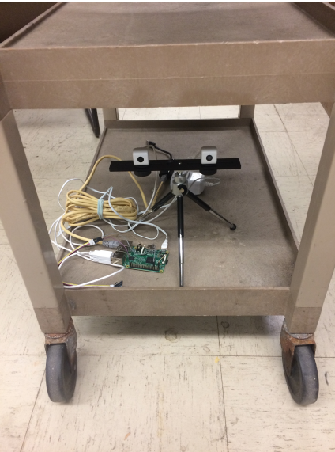
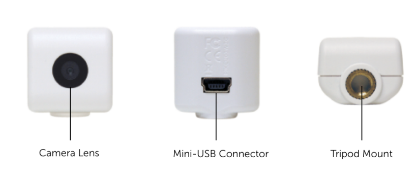
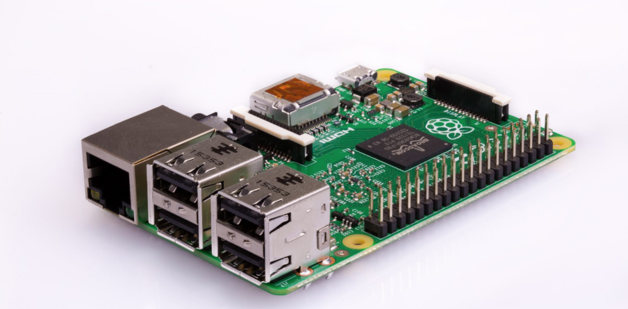

# Experimental Setup

In this setup we caliberate the camera.

We take 20 image pairs of the checkerboard's different poses including position and posture.The posture of the checkerboard in every image should be as different as possible.

In the reference paper we detect the pothole by moving two USB cameras mounted on the roller cart to imitate the cameras moving with the car, but at a low speed. 

The experimental setup includes 2 USB cameras, optical rial, tripod and raspberry Pi 2 model B.

For the software setup, opencv-python 3.3 and python 3.6
are required. 

## **The Stereo Camera**

Acc to the thesis, we use two independent USB cameras as a stereo camera.

Therefore, we make sure that the two independent cameras take photos or videos at the same time to avoid much differences between left and right images.

The paper used iCubie USB webcam. We will use intel realsense and Oak-d cameras.

## **Optical Rail and Tripod**

As two independent cameras were used by the thesis writers , the two cameras must be mounted on the same height and same horizontal direction.

Oak-D and Intel realsense cameras are already on the same horizontal level and cannot move w.r.t one another once they are fixed.

## **Raspberry Pi 2 Model B**

Raspberry Pi is a series of small single-board computers (SBCs).

In the proposed system, we use the Raspberry Pi 2 Model B19, which is a single board computer. It has a 900MHz quad-core ARM Core-A7 CPU, 1GB RAM, micro SD card slot, camera interface and display interface.

Tt has 4 USB ports, which can be used to connect with 2 USB cameras, keyboards and mouse. It has full HDMI port, which can be connected to the screen. It also has Ethernet port as well, therefore we can ssh to the raspberry Pi from the laptop when we do experiment in order to avoid taking keyboard, mouse and display with us.

