# Linear camera model 

Forward imaging model: 3D to 2D

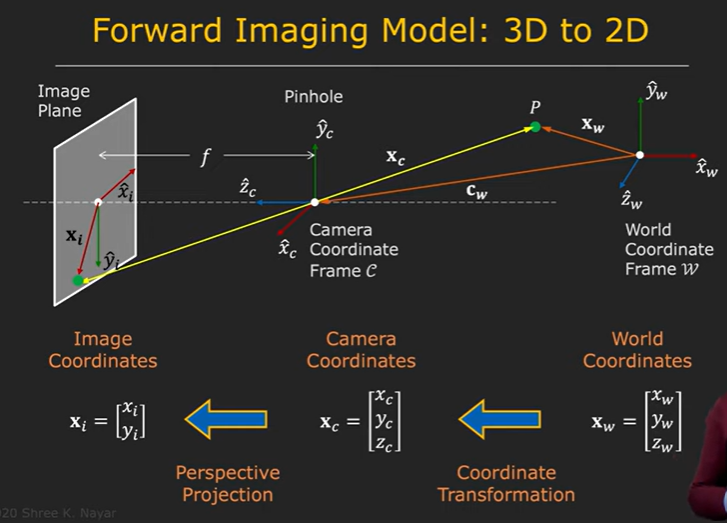

As derived in the stereo.md , we can find depth as 

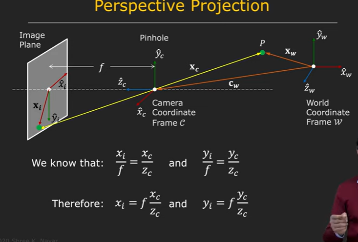

where z is the depth of object , xi and yi are coordinates of projection of point p onto the image plane

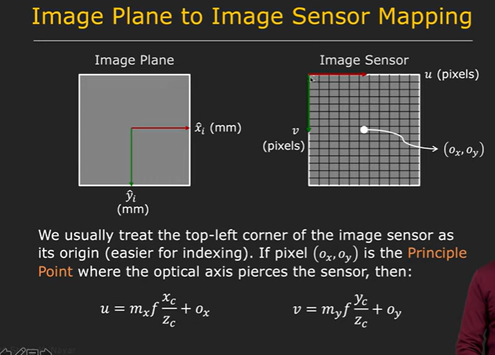

where u and v are the projectibe projection on image plane

ox and oy are center coordinates of image

mxf and myf can be written as fx and fy where fx represents the focal length of camera in x axis amd fy represents the focal length of camera in y coordinate.

These are the Intrinsic parameters of the camera.

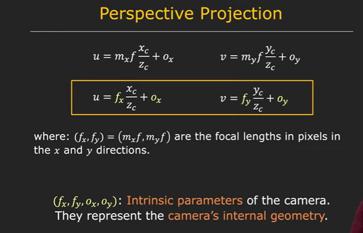

Though camera typically has only one focal length, too compensate for unequal pixel values in x and y axis (as in case of rectangular pixel), we consider focal length in x and y direction seperately.

but this model is non linear!

To go from non-linear model to linear model,we usr homogenous coordinate.
we assume a w(tilda) coordinate axis such that our plane lies on w(tilda)=1.

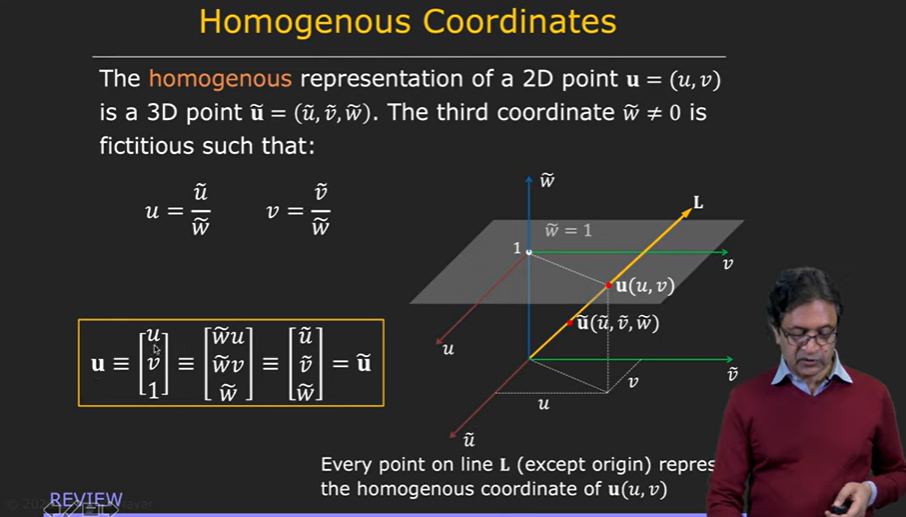

Linear models are a way of describing a response variable in terms of a linear combination of predictor variables

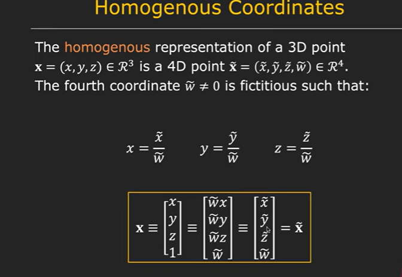

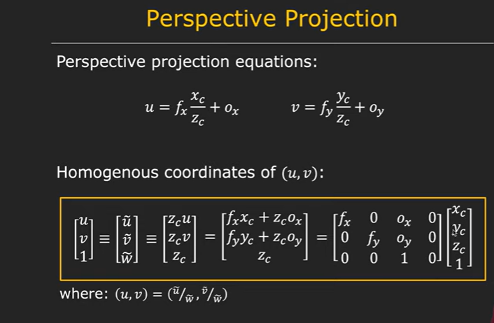

This whole matrix is called an intrinsic matrix.

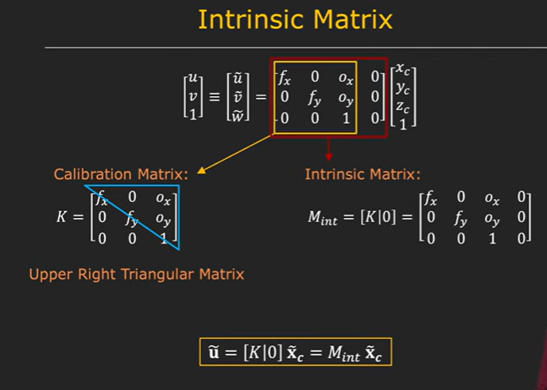

Hence we succesfully mapped coordinates of camera coordinates to image coordinates.

Now we proceed to map world coordinates to camera coordinates.

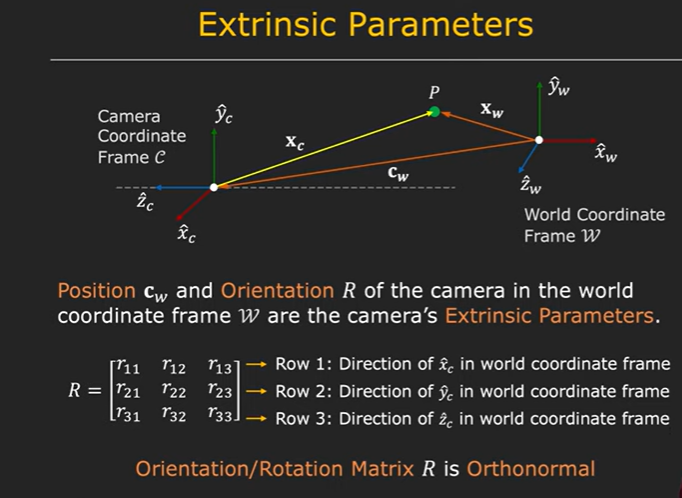

Two vectors are said to be orthonormal if on linear transformation of one vector about the other , the basis vectors of that vector remain perpendicular. Two vectors are orthonormal if and only if their dot product is zero. For more: refer Linear Algebra notes 8)Non-Squre matrices as transformation

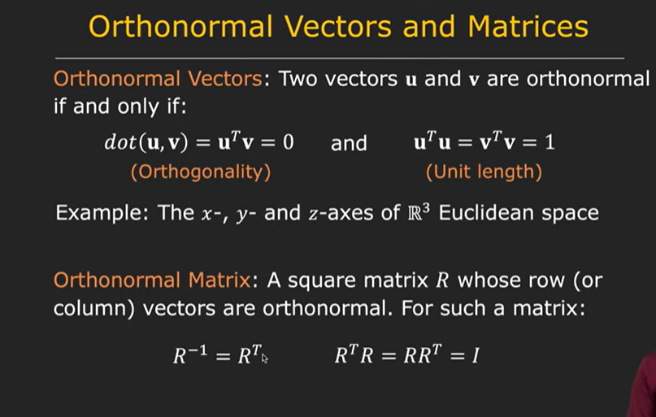

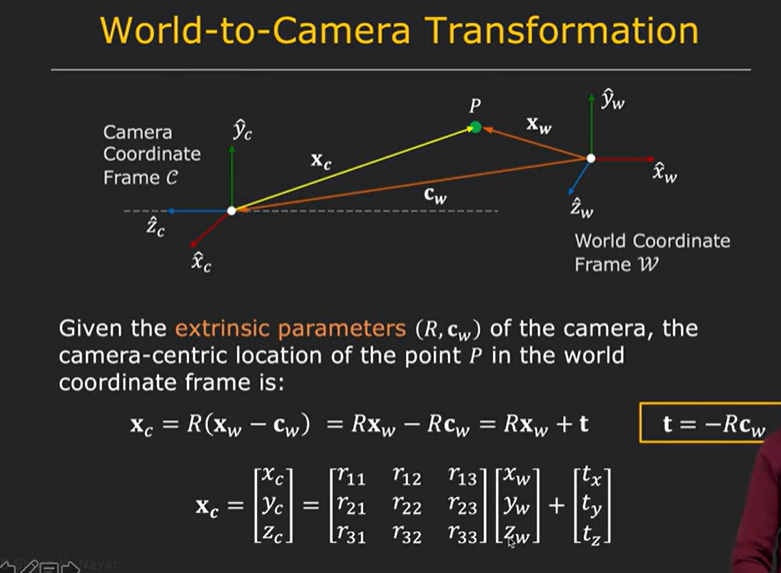

But again , this model is non-linear.

To make it linear we use homogenous coordinates.

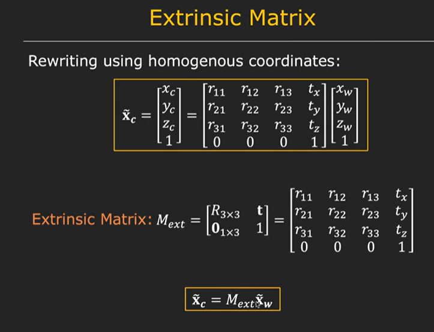

Therefore we can now figure out mapping of point of world coordinate frame to image frame.

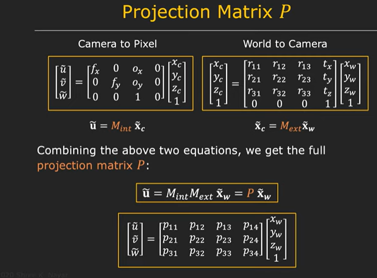