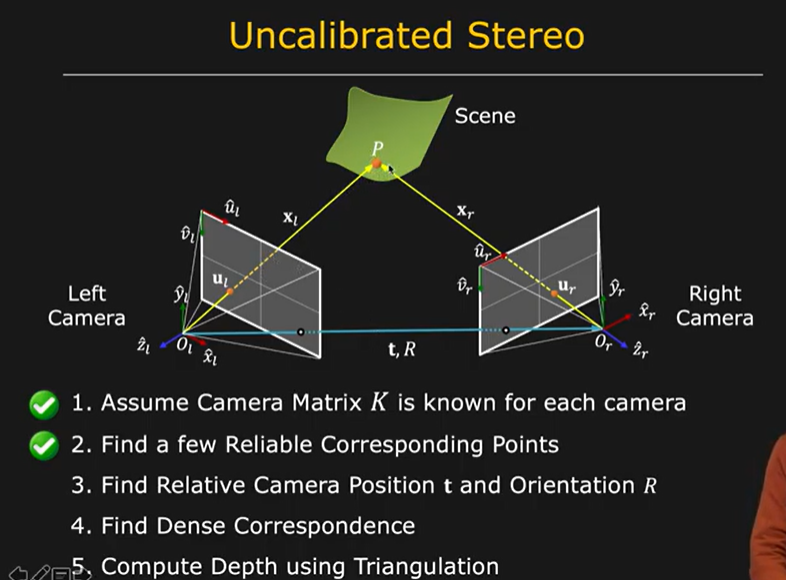

# Problem in Uncaliberated Stereo

We try to compute 3D structure of static scene from two arbitrary views

We know the intrinsic parameter of both views/cameras.

Extrinsic parameters of the two camera are unknown

